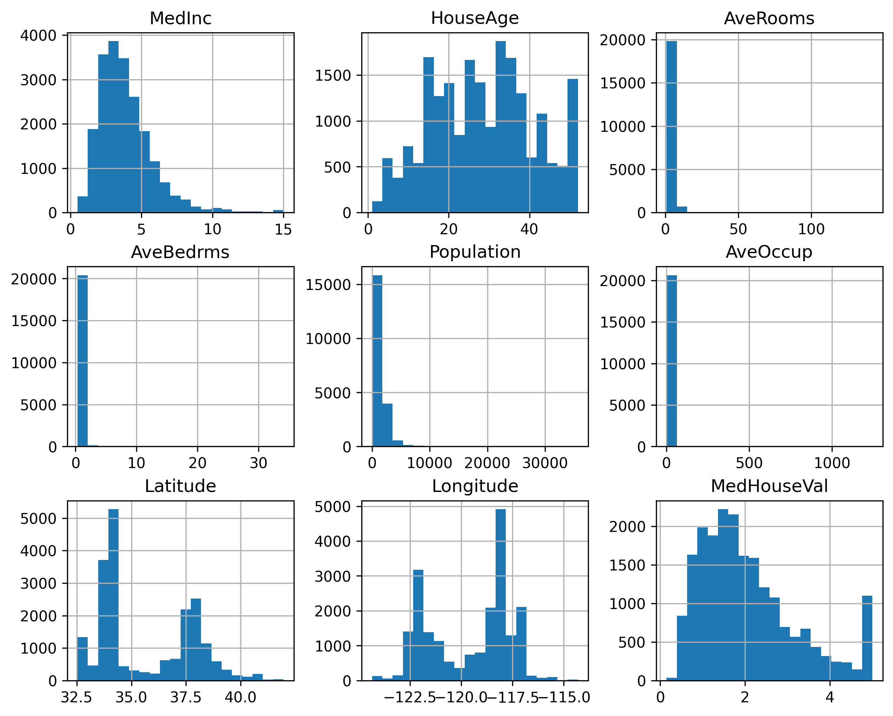
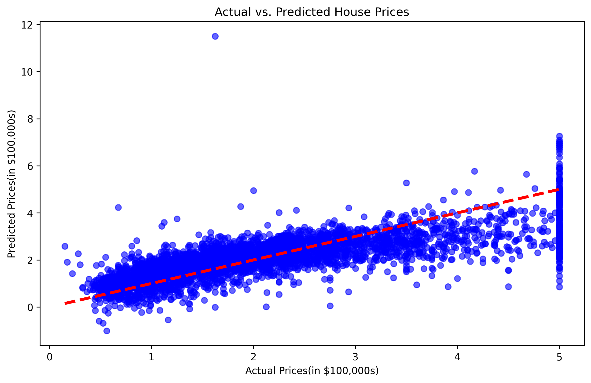
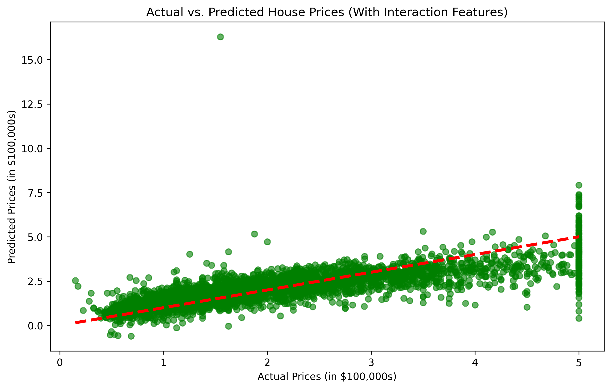

# Section 4 -- Day 3: Introduction to Machine Learning (ML)

## Objective

Day 3 is about getting hands-on experience with basic machine learning concepts. We will understand what machine learning is, the difference between supervised and unsupervised learning, and will build our first simple Linear Regression model using Scikit-learn to predict values based on historical data.
Learning Outcomes:
By the end of the day, we will:

- Understand the basic concepts of machine learning.
- Differentiate between supervised and unsupervised learning.
- Know how to perform a train-test split.
- Build a Linear Regression model for predicting continuous variables.
- Evaluate model performance using metrics like Mean Squared Error (MSE) and R-squared.


## Content
----------
18. Introduction to Day 3: Introduction to Machine Learning (ML)
19. What is Machine Learning?
20. Supervised Learning and Dataset Preparation
21. Building a Linear Regression Model
22. Evaluating the Model
23. Feature Scaling and Regularization
24. Hands-on Project: Predicting House Prices using Linear Regression
Assignment 3: Day 3: Coding Exercise
Role Play 1: Convincing the Client: Are These Predictions Reliable?


# 18. Introduction to Day 3: Introduction to Machine Learning (ML)

The objective today is about getting hands on experience with basic machine learning concepts. We will understand what machine learning is, the difference between supervised and unsupervised learning, and will build our first simple linear regression model using scikit learn to predict values based on historical data.

By the end of the day, we will understand the basic concepts of machine learning, differentiate between supervised and unsupervised learning. Know how to perform a train test split, build a linear regression model for predicting continuous variables, and finally evaluate model performance using metrics like mean squared error, MSE, and r squared.


# 19. What is Machine Learning?

Machine Learning (ML) is a branch of Artificial Intelligence (AI) that enables systems to learn from data, identify patterns, and make decisions with minimal human intervention.

There are several types of machine learning:

### Types of Machine Learning

**Supervised learning**
The model is trained on labeled data, meaning the correct output is provided during training.
- Regression (predicting continuous values)
- Classification (predicting categories or classes)

**Unsupervised Learning**
The model is trained on unlabeled data and attempts to discover patterns or structures on its own.
Examples include:
- Clustering
- Dimensionality reduction

**Linear Regression**
Linear regression is a supervised learning algorithm used to predict a continuous target variable based on one or more input features (independent variables).


# 20. Supervised Learning and Dataset Preparation

### Activities
- Dataset Overview
- Example Dataset
- Loading and Preparing the Dataset
- Train-Test Split

We want to predict house prices using features like number of rooms, house size, and age.
We will use the **California Housing Prices dataset** from [Kaggle](https://www.kaggle.com/datasets/camnugent/california-housing-prices).

Example load the data set and prepare it by splitting into features and target that

```python
import pandas as pd

# Load dataset
data = pd.read_csv('house_prices.csv')

# Split features and target
X = data[['Rooms', 'Size', 'Age']]
y = data['Price']
```		

This is how you can create your load your data set and prepare it by splitting into features and target. 


### Train-Test Split
How do you create a train test split to evaluate the model's performance?
It's important to split the data set into a training set to train the model, and a test set to evaluate the model.

```python
from sklearn.model_selection import train_test_split

# 80% training, 20% testing, reproducible with random_state
X_train, X_test, y_train, y_test = train_test_split(
    X, y, test_size=0.2, random_state=42
)
```

> 📌 `test_size=0.2` → 20% test data <br>
> 📌 `random_state=42` → reproducibility<br>

Test size equal to 0.2, which means 20% of my data is test. And then it needs something called as a random state, which will is a seed which we provide, which in this case is 42, uh, which you have to make sure that every time you use that, you use the same number 42.

So this is how you can get a particular data set. For example, in our case we have house prices dot csv.

- We take that and then we split it into features.
- And the target that we want to predict.
- And then make sure we take our data and split it into two different modules for one for training, one for testing.
- And then call  train_test_split() function which will help us do the train test split.


# 21. Building a Linear Regression Model

Activities:
- Introduction to Linear Regression
- Building the Model with Scikit-learn
- Making Predictions


Introduction to Linear Regression
---------------------------------
Linear Regression finds a linear relationship between features and the target variable:

Example formula
```
y = w1*x1 + w2*x2 + ... + wn*xn + b
```
- `y` → predicted value<br>
- `X` → input features<br>
- `W` → learned weights<br>
- `b` → bias term<br>

Now here y is the predicted value. For example, in a from a previous example we can say it's house price. X is the input features which is rooms, sizes, age of the house and W are the weights parameters learned by the model, and B is the bias term in this particular case.


### Build Model with Scikit-learn

How do you build the model with scikit learn? Now using scikit learn's linear regression class you can create the model by first importing from sklearn dot linear model.

Example formula

```python
from sklearn.linear_model import LinearRegression

# Initialize and train model
model = LinearRegression()
model.fit(X_train, y_train)

# Predict on test set
y_pred = model.predict(X_test)

print(y_pred)
```

And I can compare this predicted value with my testing target values to see if it matches.

So this is the code that you would write. If you want to build a linear regression model and get predictions.


# 22. Evaluating the Model

Activities:
- Metrics for Regression - mean squared error and r squared
- Calculating Model Performance
- Interpreting Results

### Metrics for Regression

- **Mean Squared Error (MSE)**: average squared difference between actual and predicted values<br>
- **R² (R-squared)**: how well independent variables explain variance<br>

Example formula
```
MSE = (1/n) * SUM (actual - predicted) ** 2
```

So that's the formula for mean squared error where it measures the average of squares of the errors, which is differences between actual and predicted values.

Next one is r squared. So r squared indicates how well the independent variables explain the variance in the target variable. And r square value is close to one indicates a very good model.

Example formula
```python
from sklearn.metrics import mean_squared_error, r2_score

mse = mean_squared_error(y_test, y_pred)
r2 = r2_score(y_test, y_pred)

print(f"Mean Squared Error: {mse}")
print(f"R² Score: {r2}")
```
> 📌 Lower MSE → better predictions<br>
> 📌 R² closer to 1 → model explains more variance<br>

And this is how you can calculate mean square error and r square using scikit learn's framework.

Now as for interpreting results, lower MSE indicates a model that makes better predictions, whereas higher r square which is closer to one, indicates the model explains a significant portion of the variance in the target variable.


# 23. Feature Scaling and Regularization

Activities:
- Why Feature Scaling?
- Scaling Features
- Adding Regularization (Ridge or Lasso Regression)

Here we will cover what is the need of feature scaling, what are the scaling features. And finally adding regularization where we will look at ridge or lasso regression. 

### Feature Scaling

So first why feature scaling? - Some machine learning models benefit from scaling features so that they are on a similar scale. This improves the convergence of gradient based algorithms like linear regression.

So let us look at the scaling features. We can use scikit learn's standard scaler to standardize features by removing the mean and scaling to unit variance.

Example feature scaling
```python
# import functionality
from sklearn.preprocessing import StandardScaler

# Intialize scaler
scaler = StandardScaler()

# Fit and tranform the traning data
X_train_scaled = scaler.fit_transform(X_train)

# Transform the test data
X_test_scaled = scaler.transform(X_test)
```

So this is how you can use the standard scaler to standardize features by removing the mean and scaling to unit variance.


## Regularization (Ridge / Lasso)

Lets look at adding regularization, which is either ridge or lasso regularization. Now regularization helps prevent overfitting by penalizing large coefficients. Common techniques include ridge and lasso regression.

Example ridge and lasso regression

```python
# import functionality
from sklearn.preprocessing import StandardScaler
from sklearn.linear_model import Ridge			# imported ridge regression

# Intialize scaler
scaler = StandardScaler()

# Fit and tranform the traning data
X_train_scaled = scaler.fit_transform(X_train)

# Transform the test data
X_test_scaled = scaler.transform(X_test)

# Initialize ridge regression model
ridge_model = Ridge(alpha=1.0)	# ridge model initialization - alpha - weaker or stronger regularization
ridge_model.fit(X_train_scaled, y_train)		# ridge model training

# Initialize lasso regression model
lasso_model = Ridge(alpha=1.0)				# lasso model initialization
lasso_model.fit(X_train_scaled, y_train)		# lasso model training
```


Example lasso regression
```python
# import functionality
from sklearn.preprocessing import StandardScaler
from sklearn.linear_model import Ridge, Lasso			#  imported Ridge and Lasso regression

#  Intialize scaler
scaler = StandardScaler()

#  Fit and tranform the traning data
X_train_scaled = scaler.fit_transform(X_train)

#  Transform the test data
X_test_scaled = scaler.transform(X_test)

# Initialize ridge regression model
ridge_model = Ridge(alpha=1.0)  # ridge model initialization - alpha - weaker or stronger regularization
ridge_model.fit(X_train_scaled, y_train)		#  ridge model training

# Initialize lasso regression model
lasso_model = Lasso(alpha=0.5)				# lasso model initialization - alpha - weaker or stronger regularization
lasso_model.fit(X_train_scaled, y_train)		# lasso model training
```

So this is how you can create your model and fit it with your training data by calling either the Ridge function or the lasso function.


# 24. Hands-on Project: Predicting House Prices using Linear Regression

Task: Build a Linear Regression model to predict house prices based on various input features like number of rooms, crime rate, and proximity to city centers.

Steps
- Load the Data
- Exploratory Data Analysis (EDA)
- Prepare Features and Target
- Train-Test Split
- Train the Model
- Evaluate the Model
- Visualize Results
- Model Coefficients


### Notebook Hands-On-Project-House-Prices-Model.ipynb

**step 1**
```python
import pandas as pd
import numpy as np
from sklearn.model_selection import train_test_split
from sklearn.linear_model import LinearRegression
from sklearn.metrics import mean_squared_error, r2_score
from sklearn.datasets import fetch_california_housing
import matplotlib.pyplot as plt

california = fetch_california_housing(as_frame=True)  # load automatically the set from internet (not for real projects)
df = california.frame
print(df.head())
```
Play: shift + enter<br>
Result:

   MedInc  HouseAge  AveRooms  AveBedrms  Population  AveOccup  Latitude  \
0  8.3252      41.0  6.984127   1.023810       322.0  2.555556     37.88   
1  8.3014      21.0  6.238137   0.971880      2401.0  2.109842     37.86   
2  7.2574      52.0  8.288136   1.073446       496.0  2.802260     37.85   
3  5.6431      52.0  5.817352   1.073059       558.0  2.547945     37.85   
4  3.8462      52.0  6.281853   1.081081       565.0  2.181467     37.85   

   Longitude  MedHouseVal  
0    -122.23        4.526  
1    -122.22        3.585  
2    -122.24        3.521  
3    -122.25        3.413  
4    -122.25        3.422  

**step 2**
```python
# Exploratory Data Analysis (EDA)
# Check for missing data
print(df.isnull().sum())

# show data statistics
print(df.describe())

# plot some histograms of of the features to understand their distributions
plt.savefig("histograms.png", dpi=300, bbox_inches="tight")         # save histograms as picture
df.hist(bins=20, figsize=(10,8))
plt.show()
```
Play: shift + enter<br>
Result:
### NO MISSING DATA
MedInc         0				
HouseAge       0
AveRooms       0
AveBedrms      0
Population     0
AveOccup       0
Latitude       0
Longitude      0
MedHouseVal    0
dtype: int64

### DATA DESCRIPTION 
             MedInc      HouseAge      AveRooms     AveBedrms    Population  \
count  20640.000000  20640.000000  20640.000000  20640.000000  20640.000000   		
mean       3.870671     28.639486      5.429000      1.096675   1425.476744   
std        1.899822     12.585558      2.474173      0.473911   1132.462122   
min        0.499900      1.000000      0.846154      0.333333      3.000000   
25%        2.563400     18.000000      4.440716      1.006079    787.000000   
50%        3.534800     29.000000      5.229129      1.048780   1166.000000   
75%        4.743250     37.000000      6.052381      1.099526   1725.000000   
max       15.000100     52.000000    141.909091     34.066667  35682.000000   

### DATA STATISTICS
           AveOccup      Latitude     Longitude   MedHouseVal                       
count  20640.000000  20640.000000  20640.000000  20640.000000  
mean       3.070655     35.631861   -119.569704      2.068558  
std       10.386050      2.135952      2.003532      1.153956  
min        0.692308     32.540000   -124.350000      0.149990  
25%        2.429741     33.930000   -121.800000      1.196000  
50%        2.818116     34.260000   -118.490000      1.797000  
75%        3.282261     37.710000   -118.010000      2.647250  
max     1243.333333     41.950000   -114.310000      5.000010  

### Histograms



**step 3**
```python
# - Prepare Features and Target
# prepare features by splitting the data
X = df.drop('MedHouseVal', axis=1)    # exclude the target feature from the data
y = df['MedHouseVal']                 # prepare taget variables

# - Train-Test Split
X_train, X_test, y_train, y_test = train_test_split(X, y, test_size=0.2, random_state=42)

# print shapes
print(f"Training set shape: {X_train.shape}")
print(f"Testing set shape: {X_test.shape}")
```
Play: shift + enter<br>
Result:

Training set shape: (16512, 8)<br>
Testing set shape: (4128, 8)

**step 4**
```python
# - Train the Model
# In this case Linear Regression Model

# Initialize the model
model = LinearRegression()

# Train the model
model.fit(X_train, y_train)

# creaet predictions
y_pred = model.predict(X_test)

# evaulate the model
mse = mean_squared_error(y_test, y_pred)
r2 = r2_score(y_test, y_pred)

# print the models
print(f"Mean Squared Error(MSE): {mse:.4f}")
print(f"R-Squaerd: {r2:.4f}")
```
Play: shift + enter<br>
Result:
Mean Squared Error(MSE): 0.5559<br>
R-Squaerd: 0.5758


**step 5**
```python
# - Visualize Results
# visualize actual versus predicted values
plt.figure(figsize=(10,6))
plt.scatter(y_test, y_pred, alpha=0.6, color='blue')
plt.plot([y_test.min(), y_test.max()], [y_test.min(), y_test.max()], 'r--', lw=3)
plt.title('Actual vs. Predicted House Prices')
plt.xlabel('Actual Prices(in $100,000s)')
plt.ylabel('Predicted Prices(in $100,000s)')
plt.savefig("actual_vs_predicted_prices.png", dpi=300, bbox_inches="tight")
plt.show()
```
Play: shift + enter<br>
Result:



**step 6**
```python
# - Model Coefficients
coefficients = pd.DataFrame(model.coef_, X.columns, columns=['Coefficient'])
print(coefficients)
```
Play: shift + enter<br>
Result:<br>
            Coefficient<br>
MedInc         0.448675<br>
HouseAge       0.009724<br>
AveRooms      -0.123323<br>
AveBedrms      0.783145<br>
Population    -0.000002<br>
AveOccup      -0.003526<br>
Latitude      -0.419792<br>
Longitude     -0.433708<br>

So this will this kind of shows the coefficients of the linear model that we have.

We covered a complete pipeline for predicting house prices using linear regression.


# Assignment 3: Day 3: Coding Exercise

## 1. Use the California housing dataset and try adding features (like interaction terms between variables) to see if the model's performance improves.

Create notebook Day_4_assigment_task_1.ipynb

**step 0, 1**
```python
# - Step 0: Import Libraries
import pandas as pd
import numpy as np
from sklearn.model_selection import train_test_split
from sklearn.linear_model import LinearRegression
from sklearn.metrics import mean_squared_error, r2_score
from sklearn.preprocessing import PolynomialFeatures
from sklearn.datasets import fetch_california_housing
import matplotlib.pyplot as plt

# - Step 1: Load Dataset
california = fetch_california_housing(as_frame=True)
df = california.frame
print(df.head())
```
Play: shift + enter<br>
Result:<br>
   MedInc  HouseAge  AveRooms  AveBedrms  Population  AveOccup  Latitude  \
0  8.3252      41.0  6.984127   1.023810       322.0  2.555556     37.88   
1  8.3014      21.0  6.238137   0.971880      2401.0  2.109842     37.86   
2  7.2574      52.0  8.288136   1.073446       496.0  2.802260     37.85   
3  5.6431      52.0  5.817352   1.073059       558.0  2.547945     37.85   
4  3.8462      52.0  6.281853   1.081081       565.0  2.181467     37.85   

   Longitude  MedHouseVal  
0    -122.23        4.526  
1    -122.22        3.585  
2    -122.24        3.521  
3    -122.25        3.413  
4    -122.25        3.422 


**step 2, 3**
```python
# - Step 2: Prepare Features and Target
X = df.drop('MedHouseVal', axis=1)
y = df['MedHouseVal']

# - Step 3: Add Interaction Features
# Use PolynomialFeatures with degree=2 and interaction_only=True
poly = PolynomialFeatures(degree=2, interaction_only=True, include_bias=False)
X_interactions = poly.fit_transform(X)
interaction_feature_names = poly.get_feature_names_out(X.columns)

# Convert to DataFrame for easier inspection
X_interactions_df = pd.DataFrame(X_interactions, columns=interaction_feature_names)
print(X_interactions_df.head())
```
Play: shift + enter<br>
Result:<br>
   MedInc  HouseAge  AveRooms  AveBedrms  Population  AveOccup  Latitude  \
0  8.3252      41.0  6.984127   1.023810       322.0  2.555556     37.88   
1  8.3014      21.0  6.238137   0.971880      2401.0  2.109842     37.86   
2  7.2574      52.0  8.288136   1.073446       496.0  2.802260     37.85   
3  5.6431      52.0  5.817352   1.073059       558.0  2.547945     37.85   
4  3.8462      52.0  6.281853   1.081081       565.0  2.181467     37.85   

   Longitude  MedInc HouseAge  MedInc AveRooms  ...  AveBedrms Population  \
0    -122.23         341.3332        58.144254  ...            329.666667   
1    -122.22         174.3294        51.785271  ...           2333.485062   
2    -122.24         377.3848        60.150315  ...            532.429379   
3    -122.25         293.4412        32.827897  ...            598.767123   
4    -122.25         200.0024        24.161264  ...            610.810811   

   AveBedrms AveOccup  AveBedrms Latitude  AveBedrms Longitude  \
0            2.616402           38.781905          -125.140238   
1            2.050514           36.795395          -118.783234   
2            3.008076           40.629944          -131.218079   
3            2.734096           40.615297          -131.181507   
4            2.358343           40.918919          -132.162162   

   Population AveOccup  Population Latitude  Population Longitude  \
0           822.888889             12197.36             -39358.06   
1          5065.730228             90901.86            -293450.22   
2          1389.920904             18773.60             -60631.04   
3          1421.753425             21120.30             -68215.50   
4          1232.528958             21385.25             -69071.25   

   AveOccup Latitude  AveOccup Longitude  Latitude Longitude  
0          96.804444         -312.365556          -4630.0724  
1          79.878612         -257.864868          -4627.2492  
2         106.065537         -342.548249          -4626.7840  
3          96.439726         -311.486301          -4627.1625  
4          82.568533         -266.684363          -4627.1625  

[5 rows x 36 columns]


**step 4**
```python
# - Step 4: Train-Test Split
X_train, X_test, y_train, y_test = train_test_split(X_interactions_df, y, test_size=0.2, random_state=42)

print(f"Training set shape: {X_train.shape}")
print(f"Testing set shape: {X_test.shape}")
```
Play: shift + enter<br>
Result:<br>
Training set shape: (16512, 36)<br>
Testing set shape: (4128, 36)


**step 5, 6**
```python
# - Step 5: Train Linear Regression Model with Interactions
model = LinearRegression()
model.fit(X_train, y_train)

y_pred = model.predict(X_test)

# - Step 6: Evaluate the Model
mse = mean_squared_error(y_test, y_pred)
r2 = r2_score(y_test, y_pred)

print(f"Mean Squared Error (MSE): {mse:.4f}")
print(f"R-Squared: {r2:.4f}")
```
Play: shift + enter<br>
Result:<br>
Mean Squared Error (MSE): 0.4947<br>
R-Squared: 0.6225


**step 7**
```python
# Step 7: Visualize Actual vs Predicted Prices with Interaction Features

# Create a new figure and axes explicitly
fig, ax = plt.subplots(figsize=(10,6))

# Scatter plot: actual vs predicted
ax.scatter(y_test, y_pred, alpha=0.6, color='green')

# Line for perfect prediction
ax.plot([y_test.min(), y_test.max()], [y_test.min(), y_test.max()], 'r--', lw=3)

# Titles and labels
ax.set_title('Actual vs. Predicted House Prices (With Interaction Features)')
ax.set_xlabel('Actual Prices (in $100,000s)')
ax.set_ylabel('Predicted Prices (in $100,000s)')

# Save the figure BEFORE showing it
fig.savefig("actual_vs_predicted_interactions.png", dpi=300, bbox_inches="tight")

# Show the figure
plt.show()
```
Play: shift + enter<br>
Result:<br>



**step 8**
```python
# - Step 8: Model Coefficients
coefficients = pd.DataFrame(model.coef_, interaction_feature_names, columns=['Coefficient'])
print(coefficients)
```
Play: shift + enter<br>
Result:<br>
                      Coefficient<br>
MedInc                  -9.194925<br>
HouseAge                -0.978353<br>
AveRooms                 4.720220<br>
AveBedrms              -22.991106<br>
Population              -0.001349<br>
AveOccup                 1.301899<br>
Latitude                 0.832330<br>
Longitude                0.003392<br>
MedInc HouseAge          0.001400<br>
MedInc AveRooms         -0.009513<br>
MedInc AveBedrms         0.088690<br>
MedInc Population        0.000062<br>
MedInc AveOccup         -0.001279<br>
MedInc Latitude         -0.127963<br>
MedInc Longitude        -0.117441<br>
HouseAge AveRooms       -0.002210<br>
HouseAge AveBedrms       0.018647<br>
HouseAge Population      0.000002<br>
HouseAge AveOccup       -0.003278<br>
HouseAge Latitude       -0.012109<br>
HouseAge Longitude      -0.011813<br>
AveRooms AveBedrms      -0.000997<br>
AveRooms Population     -0.000070<br>
AveRooms AveOccup        0.023923<br>
AveRooms Latitude        0.071658<br>
AveRooms Longitude       0.061070<br>
AveBedrms Population     0.000542<br>
AveBedrms AveOccup      -0.131740<br>
AveBedrms Latitude      -0.327893<br>
AveBedrms Longitude     -0.289940<br>
Population AveOccup      0.000035<br>
Population Latitude      0.000002<br>
Population Longitude    -0.000006<br>
AveOccup Latitude        0.023296<br>
AveOccup Longitude       0.018552<br>
Latitude Longitude       0.005334<br>


## 2. Experiment with a Ridge or Lasso regression model on the dataset, and compare the results with the regular Linear Regression model.


**step 1**
```python
# Import Libraries
import pandas as pd
import numpy as np
import matplotlib.pyplot as plt

from sklearn.datasets import fetch_california_housing
from sklearn.model_selection import train_test_split
from sklearn.preprocessing import StandardScaler
from sklearn.linear_model import LinearRegression, Ridge, Lasso
from sklearn.metrics import mean_squared_error, r2_score
```
Play: shift + enter<br>

**step 2**
```python
# Load Dataset
california = fetch_california_housing(as_frame=True)
df = california.frame

X = df.drop("MedHouseVal", axis=1)
y = df["MedHouseVal"]

print(df.head())
```
Play: shift + enter<br>
Result:<br>

   MedInc  HouseAge  AveRooms  AveBedrms  Population  AveOccup  Latitude  \<br>
0  8.3252      41.0  6.984127   1.023810       322.0  2.555556     37.88   <br>
1  8.3014      21.0  6.238137   0.971880      2401.0  2.109842     37.86   <br>
2  7.2574      52.0  8.288136   1.073446       496.0  2.802260     37.85   <br>
3  5.6431      52.0  5.817352   1.073059       558.0  2.547945     37.85   <br>
4  3.8462      52.0  6.281853   1.081081       565.0  2.181467     37.85   <br>

   Longitude  MedHouseVal  <br>
0    -122.23        4.526  <br>
1    -122.22        3.585  <br>
2    -122.24        3.521  <br>
3    -122.25        3.413  <br>
4    -122.25        3.422  <br>


**step 3**
```python
# Step 3 — Train-Test Split
X_train, X_test, y_train, y_test = train_test_split(
    X, y, test_size=0.2, random_state=42
)

print("Training shape:", X_train.shape)
print("Testing shape:", X_test.shape)
```
Play: shift + enter<br>
Result:<br>
Training shape: (16512, 8)<br>
Testing shape: (4128, 8)<br>


**step 4**
```python
# Step 4 — Feature Scaling (IMPORTANT for Ridge & Lasso)
# Regularization is sensitive to feature scale
scaler = StandardScaler()

X_train_scaled = scaler.fit_transform(X_train)
X_test_scaled = scaler.transform(X_test)
```
Play: shift + enter<br>


**Module 1 — Linear Regression (Baseline)**
```python
# Model 1 — Linear Regression (Baseline)
lin_model = LinearRegression()
lin_model.fit(X_train_scaled, y_train)

y_pred_lin = lin_model.predict(X_test_scaled)

mse_lin = mean_squared_error(y_test, y_pred_lin)
r2_lin = r2_score(y_test, y_pred_lin)

print("Linear Regression")
print(f"MSE: {mse_lin:.4f}")
print(f"R2:  {r2_lin:.4f}")
```
Play: shift + enter<br>
Result:<br>
Linear Regression<br>
MSE: 0.5559<br>
R2:  0.5758<br>


**Model 2 — Ridge Regression**
```python
# Model 2 — Ridge Regression
ridge_model = Ridge(alpha=1.0)
ridge_model.fit(X_train_scaled, y_train)

y_pred_ridge = ridge_model.predict(X_test_scaled)

mse_ridge = mean_squared_error(y_test, y_pred_ridge)
r2_ridge = r2_score(y_test, y_pred_ridge)

print("\nRidge Regression")
print(f"MSE: {mse_ridge:.4f}")
print(f"R2:  {r2_ridge:.4f}")
```
Play: shift + enter<br>
Result:<br>
Ridge Regression<br>
MSE: 0.5559<br>
R2:  0.5758<br>


**Model 3 — Lasso Regression**
```python
# Model 3 — Lasso Regression
lasso_model = Lasso(alpha=0.1)
lasso_model.fit(X_train_scaled, y_train)

y_pred_lasso = lasso_model.predict(X_test_scaled)

mse_lasso = mean_squared_error(y_test, y_pred_lasso)
r2_lasso = r2_score(y_test, y_pred_lasso)

print("\nLasso Regression")
print(f"MSE: {mse_lasso:.4f}")
print(f"R2:  {r2_lasso:.4f}")
```
Play: shift + enter<br>
Result:<br>
Lasso Regression<br>
MSE: 0.6796<br>
R2:  0.4814<br>


**step 5**
```python
# Step 5 — Compare Results in a Table
results = pd.DataFrame({
    "Model": ["Linear", "Ridge", "Lasso"],
    "MSE": [mse_lin, mse_ridge, mse_lasso],
    "R2 Score": [r2_lin, r2_ridge, r2_lasso]
})

print(results)
```
Play: shift + enter<br>
Result:<br>
    Model       MSE  R2 Score<br>
0  Linear  0.555892  0.575788<br>
1   Ridge  0.555855  0.575816<br>
2   Lasso  0.679629  0.481361<br>


**step 6**
```python
# Step 6 — Compare Coefficients
coef_comparison = pd.DataFrame({
    "Feature": X.columns,
    "Linear": lin_model.coef_,
    "Ridge": ridge_model.coef_,
    "Lasso": lasso_model.coef_
})

print(coef_comparison)
```
Play: shift + enter<br>
Result:<br>
      Feature    Linear     Ridge     Lasso<br>
0      MedInc  0.854383  0.854327  0.710598<br>
1    HouseAge  0.122546  0.122624  0.106453<br>
2    AveRooms -0.294410 -0.294210 -0.000000<br>
3   AveBedrms  0.339259  0.339008  0.000000<br>
4  Population -0.002308 -0.002282 -0.000000<br>
5    AveOccup -0.040829 -0.040833 -0.000000<br>
6    Latitude -0.896929 -0.896168 -0.011469<br>
7   Longitude -0.869842 -0.869071 -0.000000<br>

### Model Comparison Analysis

    Linear Regression serves as the baseline model.
    Ridge Regression reduces coefficient magnitude but usually keeps all features.
    Lasso Regression may eliminate less important features by setting coefficients to zero.
    Compare MSE and R² to determine if regularization improved performance.


**step 8**
```python
# Step 8 - Test different alpha values
for alpha in [0.01, 0.1, 1, 10]:
    model = Ridge(alpha=alpha)
    model.fit(X_train_scaled, y_train)
    print(f"Alpha={alpha}, R2={model.score(X_test_scaled, y_test):.4f}")
```
Play: shift + enter<br>
Result:<br>
Alpha=0.01, R2=0.5758<br>
Alpha=0.1, R2=0.5758<br>
Alpha=1, R2=0.5758<br>
Alpha=10, R2=0.5761<br>


## 3. Find a dataset of your choice, split it, train a regression model, and evaluate the results.


**step 1**
```python
# Step 1 — Import Libraries
import pandas as pd
import numpy as np

from sklearn.datasets import load_diabetes
from sklearn.model_selection import train_test_split
from sklearn.linear_model import LinearRegression
from sklearn.metrics import mean_squared_error, r2_score
```
Play: shift + enter<br>


**step 2**
```python
# Step 2 — Load Dataset
diabetes = load_diabetes(as_frame=True)

df = diabetes.frame

print(df.head())
```
Play: shift + enter<br>
Result:<br>
        age       sex       bmi        bp        s1        s2        s3  \<br>
0  0.038076  0.050680  0.061696  0.021872 -0.044223 -0.034821 -0.043401   <br>
1 -0.001882 -0.044642 -0.051474 -0.026328 -0.008449 -0.019163  0.074412   <br>
2  0.085299  0.050680  0.044451 -0.005670 -0.045599 -0.034194 -0.032356   <br>
3 -0.089063 -0.044642 -0.011595 -0.036656  0.012191  0.024991 -0.036038   <br>
4  0.005383 -0.044642 -0.036385  0.021872  0.003935  0.015596  0.008142   <br>
<br>
         s4        s5        s6  target  <br>
0 -0.002592  0.019907 -0.017646   151.0  <br>
1 -0.039493 -0.068332 -0.092204    75.0  <br>
2 -0.002592  0.002861 -0.025930   141.0  <br>
3  0.034309  0.022688 -0.009362   206.0  <br>
4 -0.002592 -0.031988 -0.046641   135.0  <br>


**Separate features and target**
```python
# Separate features and target
X = df.drop("target", axis=1)
y = df["target"]
```
Play: shift + enter<br>


**step 4**
```python
# Step 4 —Train a Regression Model
model = LinearRegression()
model.fit(X_train, y_train)
```
Play: shift + enter<br>
Result:<br>
Parameters<br>
fit_intercept:	True<br>
copy_X:	True<br>
tol:	1e-06<br>
n_jobs:	None<br>
positive:	False<br>

**step 5**
```python
# Step 5 — Make Predictions
y_pred = model.predict(X_test)
```
Play: shift + enter<br>

**step 6**
```python
# Step 6 — Evaluate the Model
mse = mean_squared_error(y_test, y_pred)
rmse = np.sqrt(mse)
r2 = r2_score(y_test, y_pred)

print("MSE:", mse)
print("RMSE:", rmse)
print("R² Score:", r2)
```
Play: shift + enter<br>
Result:<br>
MSE: 2900.1936284934804<br>
RMSE: 53.85344583676592<br>
R² Score: 0.4526027629719197<br>

📊 How to Interpret the Results

🔹 MSE (Mean Squared Error)
Lower = better
Measures average squared difference between actual and predicted values

🔹 RMSE
Same unit as the target
Easier to interpret than MSE

🔹 R² Score
Between 0 and 1
Closer to 1 = better fit
Around 0.4–0.5 is normal for this dataset


**step 7**
```python
Step 7 - View Model Coefficients
coefficients = pd.DataFrame(model.coef_, X.columns, columns=["Coefficient"])
print(coefficients)
```
Play: shift + enter<br>
Result:<br>
     Coefficient<br>
age    37.904021<br>
sex  -241.964362<br>
bmi   542.428759<br>
bp    347.703844<br>
s1   -931.488846<br>
s2    518.062277<br>
s3    163.419983<br>
s4    275.317902<br>
s5    736.198859<br>
s6     48.670657<br>


# AI School solutions:

**TASK 1**
```python
# Import necessary libraries
import pandas as pd
from sklearn.model_selection import train_test_split
from sklearn.linear_model import LinearRegression
from sklearn.metrics import mean_squared_error, r2_score
from sklearn.preprocessing import PolynomialFeatures
from sklearn.datasets import fetch_california_housing

# Load the California housing dataset
data = fetch_california_housing(as_frame=True)
df = data.frame

# Step 1: Split the dataset into features (X) and target (y)
X = df.drop('MedHouseVal', axis=1)
y = df['MedHouseVal']

# Step 2: Split the data into training and testing sets (without interaction terms)
X_train, X_test, y_train, y_test = train_test_split(X, y, test_size=0.2, random_state=42)

# Step 3: Train a Linear Regression model (without interaction terms)
model = LinearRegression()
model.fit(X_train, y_train)
y_pred_no_interaction = model.predict(X_test)

# Evaluate the model's performance without interaction terms
mse_no_interaction = mean_squared_error(y_test, y_pred_no_interaction)
r2_no_interaction = r2_score(y_test, y_pred_no_interaction)

# Step 4: Add interaction terms between variables using PolynomialFeatures
poly = PolynomialFeatures(degree=2, interaction_only=True, include_bias=False)
X_poly = poly.fit_transform(X)

# Step 5: Split the data again into training and testing sets (with interaction terms)
X_train_poly, X_test_poly, y_train_poly, y_test_poly = train_test_split(X_poly, y, test_size=0.2, random_state=42)

# Step 6: Train a Linear Regression model (with interaction terms)
model_poly = LinearRegression()
model_poly.fit(X_train_poly, y_train_poly)
y_pred_with_interaction = model_poly.predict(X_test_poly)

# Evaluate the model's performance with interaction terms
mse_with_interaction = mean_squared_error(y_test_poly, y_pred_with_interaction)
r2_with_interaction = r2_score(y_test_poly, y_pred_with_interaction)

# Step 7: Output the performance metrics for comparison
performance_comparison = {
    "Without Interaction Terms": {
        "Mean Squared Error": mse_no_interaction,
        "R-squared": r2_no_interaction
    },
    "With Interaction Terms": {
        "Mean Squared Error": mse_with_interaction,
        "R-squared": r2_with_interaction
    }
}

# Print the comparison
print(performance_comparison)
```
Play: shift + enter<br>


**TASK 2**
```python
# Import necessary libraries
import pandas as pd
from sklearn.model_selection import train_test_split
from sklearn.linear_model import LinearRegression, Ridge, Lasso
from sklearn.metrics import mean_squared_error, r2_score
from sklearn.datasets import fetch_california_housing

# Load the California housing dataset
data = fetch_california_housing(as_frame=True)
df = data.frame

# Step 1: Split the dataset into features (X) and target (y)
X = df.drop('MedHouseVal', axis=1)
y = df['MedHouseVal']

# Step 2: Split the data into training and testing sets
X_train, X_test, y_train, y_test = train_test_split(X, y, test_size=0.2, random_state=42)

# Step 3: Train a Linear Regression model
linear_model = LinearRegression()
linear_model.fit(X_train, y_train)
y_pred_linear = linear_model.predict(X_test)

# Step 4: Train a Ridge Regression model (with regularization)
ridge_model = Ridge(alpha=1.0)  # Adjust alpha for more/less regularization
ridge_model.fit(X_train, y_train)
y_pred_ridge = ridge_model.predict(X_test)

# Step 5: Train a Lasso Regression model (with regularization)
lasso_model = Lasso(alpha=0.1)  # Adjust alpha for more/less regularization
lasso_model.fit(X_train, y_train)
y_pred_lasso = lasso_model.predict(X_test)

# Step 6: Evaluate the models' performance
performance_comparison = {
    "Linear Regression": {
        "Mean Squared Error": mean_squared_error(y_test, y_pred_linear),
        "R-squared": r2_score(y_test, y_pred_linear)
    },
    "Ridge Regression": {
        "Mean Squared Error": mean_squared_error(y_test, y_pred_ridge),
        "R-squared": r2_score(y_test, y_pred_ridge)
    },
    "Lasso Regression": {
        "Mean Squared Error": mean_squared_error(y_test, y_pred_lasso),
        "R-squared": r2_score(y_test, y_pred_lasso)
    }
}

# Print the comparison of the models' performance
print("Model Performance Comparison:")
for model, metrics in performance_comparison.items():
    print(f"\n{model}:")
    for metric, value in metrics.items():
        print(f"{metric}: {value:.4f}")

```
Play: shift + enter<br>
Result:<br>


**YASK 3**
```python
# Import necessary libraries
import pandas as pd
from sklearn.model_selection import train_test_split
from sklearn.linear_model import LinearRegression
from sklearn.metrics import mean_squared_error, r2_score
from sklearn.datasets import load_boston

# Step 1: Load a dataset (Boston Housing Dataset in this case)
boston = load_boston()
df = pd.DataFrame(boston.data, columns=boston.feature_names)
df['PRICE'] = boston.target  # Adding the target variable (house prices)

# Step 2: Split the dataset into features (X) and target (y)
X = df.drop('PRICE', axis=1)  # Features
y = df['PRICE']  # Target variable (house prices)

# Step 3: Split the data into training and testing sets
X_train, X_test, y_train, y_test = train_test_split(X, y, test_size=0.2, random_state=42)

# Step 4: Train a Linear Regression model
model = LinearRegression()
model.fit(X_train, y_train)

# Step 5: Make predictions on the test data
y_pred = model.predict(X_test)

# Step 6: Evaluate the model's performance
mse = mean_squared_error(y_test, y_pred)
r2 = r2_score(y_test, y_pred)

# Output the evaluation metrics
print(f"Mean Squared Error: {mse:.4f}")
print(f"R-squared: {r2:.4f}")

# Display the first few predicted vs actual values
comparison_df = pd.DataFrame({'Actual': y_test, 'Predicted': y_pred})
print("\nComparison of Actual vs Predicted Prices:")
print(comparison_df.head())
```
Play: shift + enter<br>
Result:<br>