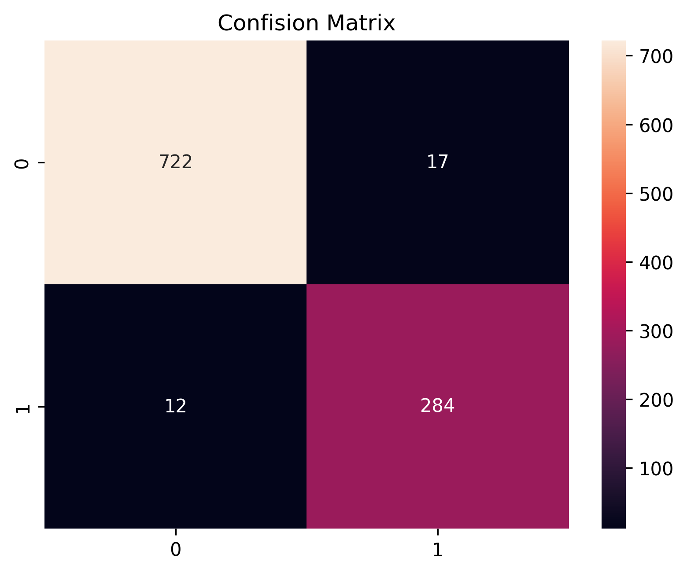
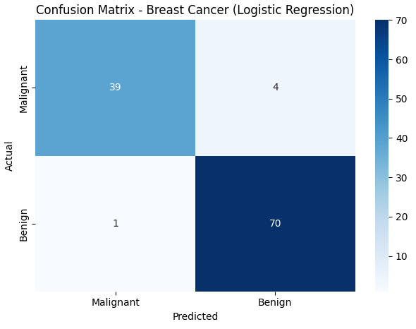
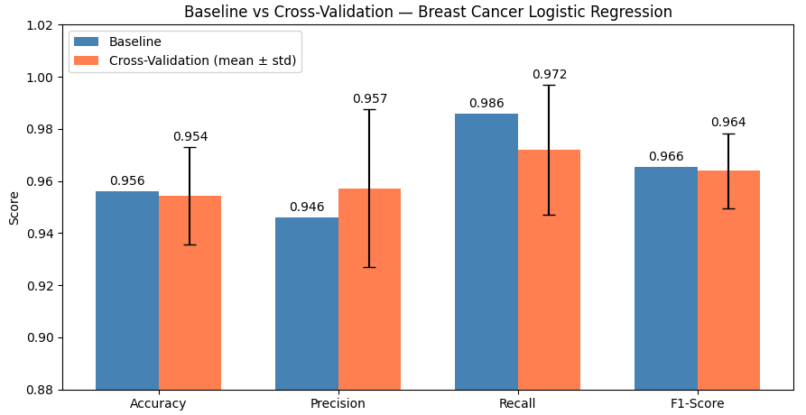
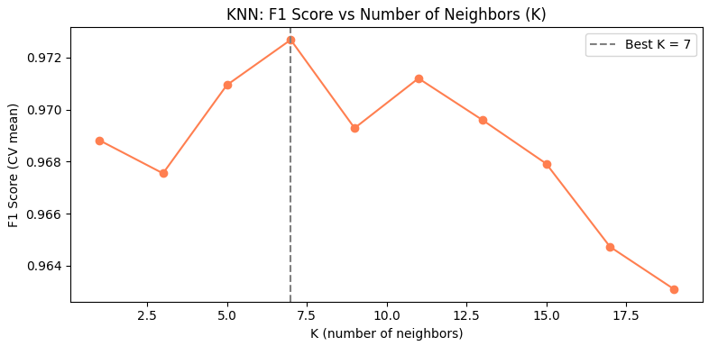
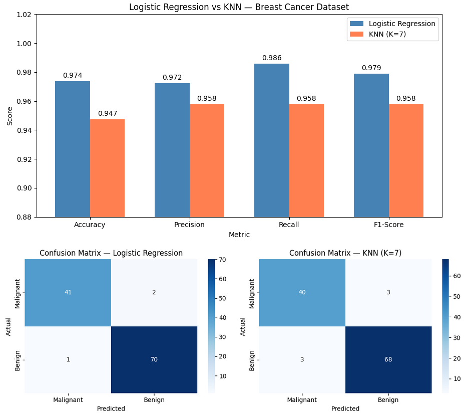

# Section 5  Day 4 - Classification Models in Machine Learning

### Objective:

Day 4 focuses on classification, a type of supervised learning where the goal is to categorize data into predefined labels. We will build a Logistic Regression model to classify whether an email is spam or not and explore key concepts of classification, including performance metrics such as accuracy, precision, recall, and confusion matrix.

### Learning Outcomes:
By the end of the day, we will:
- Understand the basics of classification and how it differs from regression.
- Build and train a Logistic Regression classifier.
- Understand and compute performance metrics such as accuracy, precision, recall, F1-score, and confusion matrix.
- Visualize the decision boundary of a classification model.
- Be able to apply classification algorithms to a real-world dataset.


Content
-------
25. [Introduction to Day 4: Classification Models in Machine Learning](#25-introduction-to-day-4-classification-models-in-machine-learning)
26. [What is Classification?](#26-what-is-classification)
27. [Logistic Regression for Classification](#27-logistic-regression-for-classification)
28. [Building a Logistic Regression Classifier](#28-building-a-logistic-regression-classifier)
29. [Evaluating the Classification Model](#29-evaluating-the-classification-model)
30. [Visualizing the Decision Boundary](#30-visualizing-the-decision-boundary)
31. [Hands-on Project: Spam Detection Using Logistic Regression](#31-hands-on-project-spam-detection-using-logistic-regression)
    
[Assignment 4: Day 4: Coding Exercise](#assignment-4-day-4-coding-exercise)


## 25. Introduction to Day 4: Classification Models in Machine Learning

Therefore, classification models in machine learning are objective for day four focuses on classification, a type of supervised learning where the goal is to categorize data into predefined labels. 

We will build a logistic regression model to classify whether an email is spam or not, and explore key concepts of classification, including performance metrics such as 
- accuracy
- precision
- recall
- confusion matrix.

The learning objectives is by the end of the day, we will understand the basics of classification and how it differs from regression. Build and train a logistic regression classifier. Understand and compute performance metrics such as accuracy, precision, recall, F1 score and confusion matrix and visualize the decision boundary of a classification model. 

And finally, be able to apply classification algorithms to a real world data set.


## 26. What is Classification?

### Logistic Regression for Classification
- What is Logistic Regression?
- Dataset Overview


Our first topic today is what is classification?

Classification is the task of predicting the class or category of an input based on its features. Unlike regression, where the output is continuous, in classification the output is categorical.

Example is the email spam or it is not spam.

Examples of classification problems include predicting whether an email is spam or not, which is a binary classification. Classifying an image as either a cat, dog, or bird, which is also called as multi-class classification, or can be predicting whether a customer will churn, which is again a binary classification.

## 27. Logistic Regression for Classification

Logistic regression is a supervised learning algorithm used for binary classification problems. It predicts the probability of an instance belonging to a particular class using the logistic or sigmoid function.


**Example formula**
```python
P(y=1) = 1/(1 + e ** (-z)), where z = w*x + b
```
> 📌 b is the bias that we have<br>

So this is how a logistic regression is defined.

To look at the data set overview, we will be using the spam detection data set to classify emails as either scam which is one or not scam which is zero based on the features like the frequency of certain words.


## 28. Building a Logistic Regression Classifier

We will build Logistic Regression Classifier in 3 steps:
### Step 1: Loading and Preparing the Dataset
Here we will load the data set and split it into training and testing sets.

### Step 2: Training the Logistic Regression Model
Next step is training the logistic regression model. We will train a logistic regression model using scikit learn.

### Step 3: Making Predictions
The third or third step is making predictions. We will use the trained model to predict whether the emails in a test set are spam or not.

**Example**
```python
# import functionalities
import pandas as pd
from sklearn.model_selection import train_test_split
from sklearn.linear_model import LogisticRegression

# load dataset
data = pd.read_csv('spam_data.csv')     # all emails

# exclude the spam data from the dataset
 X = data.drop('Spam', axis=1)          

# set Spam as target variable
 y = data['Spam']                       

# # - Step 4: Train-Test Split, 80% training, 20% testing, reproducible with random_state
X_train, X_test, y_train, y_test = train_test_split(X, y, test_size=0.2, random_state=42)

# initialize Loginstic Regression model
model = LogisticRegression()

# train the model
model.fit(X_train, y_train)

# Predict on test set
y_pred = model.predict(X_test)

# print prediction
print(y_pred)
```


## 29. Evaluating the Classification Model

### Confusion Matrix
confusion matrix is a table that summarizes the performance of a classification algorithm by comparing actual and predicted values. These can be true positives, which is also denoted as TP, which is correctly predicted as spam in our use case. True negative TN correctly predicted as not spam. False positives FP which is incorrectly predicted as spam. False alarm. And then we have false negative which is FN incorrectly predicted as not spam.

**Example**
```python
from sklearn.metrics import confusion_matrix

cm = confusion_metrix(y_test, y_pred)
print(cm)
```

### Accuracy
Accuracy is the ratio of correctly predicted observations to the total observations, which means the formula comes something like this.

**Example**
```python
from sklearn.metrics import confusion_matrix, accuracy_score

cm = confusion_metrix(y_test, y_pred)
print(cm)

# Accuracy formula is implemented in sklearn.metrics
# Accuracy = (TP + TN) / (TP + TN + FP + FN)
accuracy = accuracy_score(y_test, y_pred)
print(accuracy)
```

### Precision and Recall
Precision is the ratio of correctly predicted positive observations to the total predicted positives which are spam.

**Example**
```python
from sklearn.metrics import confusion_matrix, accuracy_score, precision_score, recall_score, f1_score

cm = confusion_metrix(y_test, y_pred)
print(cm)

# Accuracy formula is implemented in sklearn.metrics
# Accuracy = (TP + TN) / (TP + TN + FP + FN)
accuracy = accuracy_score(y_test, y_pred)
print(accuracy)

# Precision formula is implemented in sklearn.metrics
# correctly predicted positive observations to the total predicted positives, which is true positives and false positives.
# Precision = TP / (TP + FP)
precision = precision_score(y_test, y_pred)

# Recall formula is implemented in sklearn.metrics
# Recall called a sensitivity, is the ratio of correctly predicted positive observations to all observations in the actual class.
# Recall = TP / (TP + FN)
recall = recall_score(y_test, y_pred)
```
these are the four different main ones which is confusion matrix, accuracy, precision, recall. 

### F1-Score

And finally we also have the F1 score.

**Example**
```python
from sklearn.metrics import confusion_matrix, accuracy_score, precision_score, recall_score, f1_score

cm = confusion_metrix(y_test, y_pred)
print(cm)

# Accuracy formula is implemented in sklearn.metrics
# Accuracy = (TP + TN) / (TP + TN + FP + FN)
accuracy = accuracy_score(y_test, y_pred)
print(accuracy)

# Precision formula is implemented in sklearn.metrics
# correctly predicted positive observations to the total predicted positives, which is true positives and false positives.
# Precision = TP / (TP + FP)
precision = precision_score(y_test, y_pred)

# Recall formula is implemented in sklearn.metrics
# Recall called a sensitivity, is the ratio of correctly predicted positive observations to all observations in the actual class.
# Recall = TP / (TP + FN)
recall = recall_score(y_test, y_pred)

# F1 formula is implemented in sklearn.metrics
# F1 score is the harmonic mean of the precision and recall, providing a balance between the two when precision and recall are not equally important.
# F1 score = 2 *(Precision * Recall) / (Precision + Recall)
f1 = f1_score(y_test, y_pred)
```

So in this particular example we covered evaluation of the classification model using confusion matrix accuracy, precision and recall and F1 score.


## 30. Visualizing the Decision Boundary

### Why Visualize the Decision Boundary?
Visualizing the decision boundary helps in understanding how the model separates different classes. In our case it is like how does it separate spam versus not spam?


### Visualizing with a 2D Feature Set
Visualizing with the 2D feature set for this, you can reduce the data set that you have into two features for easier visualization.

**Example**
```python
import matplotlib.pyplot as plt
import numpy as np

# define a meshgrid for plotting decision boundary
# This defines a step size where h that will be used to create the mesh grid. The mesh grid is essentially a 2D grid that divides the feature space into small squares
# The step size controls how fine or coarse the grid will be
h = 0.02

# Extract the minimum and maximum values from the first feature of the test data
# X_test[:, 0]min(), max() - selects all the rows because I have specified colon of the first column, which is zero, representing the one feature in the feature space
# x_min, x_max - These variables define the range for the x axis of the plot by subtracting one from the minimum and adding one to the maximum, you extend the range slightly beyond the data points to make the plot look cleaner
x_min, x_max = X_test[:, 0].min() - 1, X_test[:, 0].max() + 1

# X_test[:, 1]min(), max() - Extract the minimum and maximum values from the second feature of the test data
# y_min, y_max - These variables define the range for the y axis in the same way as x min and max for the x axis
y_min, y_max = X_test[:, 1].min() - 1, X_test[:, 1].max() + 1

# Creating the mesh grid
# np.meshgrid(np.arange(x_min, x_max, h) - generates a 1D array of equally spaced values between x and x max with spacing of h - this array represents points along the x axis of the grid
# np.meshgrid - This function takes two 1D arrays for x and y and returns two 2D arrays xx and yy, where xx represents the x coordinates and yy represents the y coordinates of the grid. This forms a grid of points that will be used to evaluate the model's predictions across the feature space.
xx, yy = np.meshgrid(np.arange(x_min, x_max, h), np.arrange(y_min, y_max, h))


# Predicting the class for each point of the on the grid
# ravel() methods flatten the 2D arrays xx and yy into 1D arrays. his is necessary because the model predict function method expects a 2D array of input points
# np.c_[xx.ravel(), yy.ravel() - concatenates the flattened xx and yy arrays a column wise, this creates a 2D array where each row is a pair of x and y coordinates from the meshgrid
# These coordinates will be fed into the model to predict the class for each point on the on the grid
# model.predict() - This uses the trained model such as classification model to predict the class label for each point in the grid
# Z.reshape(xx.shape) - the predicted values z are reshaped back into the original 2D shape of x. This allows the predictions to be visualized as as a surface or contour plot over the grid
Z = model.predict(np.c_[xx.ravel(), yy.ravel()])
Z = Z.reshape(xx.shape)

# Plotting the decision boundary and data points for that
# This this creates a filled contour plot. It takes the mesh grid xx and yy and the predicted values z to draw decision boundaries between the different predicted classes
# The alpha 0.8 parameter controls the transparency of the filled contour regions, allowing some background to show through
plt.contourf(xx, yy, Z, alpha=0.8)

# Plotting the test data points
# plt.scatter() - plots the actual test data points on the same plot. It uses X test, the first feature for the x coordinates, the second features for the y coordinates, and c is equal to y test
# This colors the points based on the on the actual class labels, which is y test
# edgecolors='k' - black edges k around the data points
# marker='o' - specifies the shape of the markers which is in circles
# s=100 - sets the size of the markers to 100, relatively large for the visibility
plt.scatter(X_test,[:, 0], X_test[:, 1], c=y_test, edgecolors='k', marker='o', s=100)

# Print the plot
# renders and displays the final plot, which includes both the decision boundary from the model's prediction and the actual test data points
plt.show()
```

So that covers our visualizing the decision boundary.


## 31. Hands-on Project: Spam Detection Using Logistic Regression
The task here is to build a logistic regression classifier to predict whether an email is spam or not, based on features such as word frequency and email length.

Steps:
- Load the dataset and split it into training and testing sets.
- Train the Logistic Regression model to classify emails as spam or not spam.
- Evaluate the model using accuracy, confusion matrix, precision, recall, and F1-score.
- Visualize the confusion matrix using Seaborn’s heatmap.

Download dataset 'Email Spam Classification Dataset CSV - https://www.kaggle.com/datasets/balaka18/email-spam-classification-dataset-csv, unarchive it and rename the dataset to spam_data.csv


Create new notebook Day_4_Hands_on_project_Spam_Detection_Using_Logistic_Regression

**Step 0 - import functionalities**
```python
# Step 0 - import functionalities
import pandas as pd
from sklearn.model_selection import train_test_split
from sklearn.linear_model import LogisticRegression
from sklearn.metrics import confusion_matrix, accuracy_score, precision_score, recall_score, f1_score
import seaborn as sns
import matplotlib.pyplot as plt
```
Play: shift + enter<br>

**Step 1-4**
```python
# Step 1 - Load the dataset and split it into training and testing sets.
data = pd.read_csv('spam_data.csv')

# exclude the 'Prediction data from the dataset'
X = data.drop(['Prediction', 'Email No.'], axis=1)

# set target variable
y = data['Prediction']


# Split the data
X_train, X_test, y_train, y_test = train_test_split(X, y, test_size=0.2, random_state=42)

# Step 2 - Train the Logistic Regression model to classify emails as spam or not spam.
# model = LogisticRegression()
model = LogisticRegression(max_iter=1000)
model.fit(X_train, y_train)

# Create prediction
y_pred = model.predict(X_test)

# Step 3 - Evaluate the model using accuracy, confusion matrix, precision, recall, and F1-score.
accuracy = accuracy_score(y_test, y_pred)
precision = precision_score(y_test, y_pred)
recall = recall_score(y_test, y_pred)
f1 = f1_score(y_test, y_pred)

# print the evaluation metrix
print(f"Accuracy: {accuracy}")
print(f"Precision: {precision}")
print(f"Recall: {recall}")
print(f"F1_score: {f1}")

# Step 4 - Visualize the confusion matrix using Seaborn’s heatmap.
cm = confusion_matrix(y_test, y_pred)

# visualize heatmap with seaborn
sns.heatmap(cm, annot=True, fmt='d')
# set title for the heatmap
plt.title('Confision Matrix')
# save the heatmap as image
plt.savefig("spam_heatmap.png", dpi=300, bbox_inches="tight") 
# print the heatmap
plt.show()
```
Play: shift + enter<br>
Result:<br>

Accuracy: 0.9719806763285024<br>
Precision: 0.9435215946843853<br>
Recall: 0.9594594594594594<br>
F1_score: 0.9514237855946399<br>

Everything is in pretty much in 90 percentiles. So that's pretty good




## Assignment 4: Day 4: Coding Exercise

Try to complete these assignments using Jupyter Notebook or your favorite editor in Python
Questions for this assignment

Build a logistic regression model for another binary classification dataset (e.g., breast cancer diagnosis).

Use cross-validation to improve the performance of the model and compare it with the baseline.

Try a different classification algorithm like K-Nearest Neighbors (KNN) and compare the performance with logistic regression.

**TASK 1**
```python
# Step 0 - Import functionalities
import pandas as pd
from sklearn.datasets import load_breast_cancer
from sklearn.model_selection import train_test_split
from sklearn.linear_model import LogisticRegression
from sklearn.metrics import (confusion_matrix, accuracy_score,
                             precision_score, recall_score, f1_score)
import seaborn as sns
import matplotlib.pyplot as plt

# Step 1 - Load the dataset
cancer = load_breast_cancer()

# Features (30 measurements like radius, texture, area...)
X = pd.DataFrame(cancer.data, columns=cancer.feature_names)

# Target: 0 = malignant (cancer), 1 = benign (healthy)
y = pd.Series(cancer.target)

print("Dataset shape:", X.shape)
print("Class distribution:\n", y.value_counts())

# Step 2 - Train/Test Split (80% train, 20% test)
X_train, X_test, y_train, y_test = train_test_split(
    X, y, test_size=0.2, random_state=42
)

# Step 3 - Train the Logistic Regression model
model = LogisticRegression(max_iter=10000)
model.fit(X_train, y_train)

# Step 4 - Make predictions
y_pred = model.predict(X_test)

# Step 5 - Evaluate the model
accuracy  = accuracy_score(y_test, y_pred)
precision = precision_score(y_test, y_pred)
recall    = recall_score(y_test, y_pred)
f1        = f1_score(y_test, y_pred)

print(f"\nAccuracy:  {accuracy:.4f}")
print(f"Precision: {precision:.4f}")
print(f"Recall:    {recall:.4f}")
print(f"F1-Score:  {f1:.4f}")

# Step 6 - Visualize the Confusion Matrix
cm = confusion_matrix(y_test, y_pred)

sns.heatmap(cm, annot=True, fmt='d', cmap='Blues',
            xticklabels=['Malignant', 'Benign'],
            yticklabels=['Malignant', 'Benign'])
plt.title('Confusion Matrix - Breast Cancer (Logistic Regression)')
plt.ylabel('Actual')
plt.xlabel('Predicted')
plt.tight_layout()
plt.savefig("breast_cancer_heatmap.png", dpi=300, bbox_inches="tight")
plt.show()
```
Play: shift + enter<br>
Result:<br>
Dataset shape: (569, 30)        
Class distribution:     
 1    357       
0    212        
Name: count, dtype: int64       

Accuracy:  0.9561
Precision: 0.9459
Recall:    0.9859
F1-Score:  0.9655




**TASK 2**
```python
# ============================================================
# Task 2 - Cross-Validation vs Baseline
# ============================================================

# Step 0 - Import functionalities
from sklearn.datasets import load_breast_cancer
from sklearn.linear_model import LogisticRegression
from sklearn.model_selection import train_test_split, cross_val_score, StratifiedKFold
from sklearn.metrics import accuracy_score, precision_score, recall_score, f1_score
import numpy as np
import matplotlib.pyplot as plt

# Step 1 - Load dataset (same as Task 1)
cancer = load_breast_cancer()
X = cancer.data
y = cancer.target

# -------------------------------------------------------
# BASELINE (from Task 1) - single train/test split
# -------------------------------------------------------
X_train, X_test, y_train, y_test = train_test_split(
    X, y, test_size=0.2, random_state=42
)

baseline_model = LogisticRegression(max_iter=10000)
baseline_model.fit(X_train, y_train)
y_pred = baseline_model.predict(X_test)

baseline_scores = {
    "Accuracy":  accuracy_score(y_test, y_pred),
    "Precision": precision_score(y_test, y_pred),
    "Recall":    recall_score(y_test, y_pred),
    "F1-Score":  f1_score(y_test, y_pred),
}

print("=== BASELINE (single train/test split) ===")
for metric, value in baseline_scores.items():
    print(f"{metric}: {value:.4f}")

# -------------------------------------------------------
# CROSS-VALIDATION - 5-fold stratified CV
# -------------------------------------------------------
# StratifiedKFold keeps the class ratio balanced in each fold
cv = StratifiedKFold(n_splits=5, shuffle=True, random_state=42)
cv_model = LogisticRegression(max_iter=10000)

# Run CV for each metric separately
cv_accuracy  = cross_val_score(cv_model, X, y, cv=cv, scoring='accuracy')
cv_precision = cross_val_score(cv_model, X, y, cv=cv, scoring='precision')
cv_recall    = cross_val_score(cv_model, X, y, cv=cv, scoring='recall')
cv_f1        = cross_val_score(cv_model, X, y, cv=cv, scoring='f1')

print("\n=== CROSS-VALIDATION (5-fold) ===")
print(f"Accuracy  per fold: {cv_accuracy.round(4)}  → Mean: {cv_accuracy.mean():.4f} ± {cv_accuracy.std():.4f}")
print(f"Precision per fold: {cv_precision.round(4)} → Mean: {cv_precision.mean():.4f} ± {cv_precision.std():.4f}")
print(f"Recall    per fold: {cv_recall.round(4)}    → Mean: {cv_recall.mean():.4f} ± {cv_recall.std():.4f}")
print(f"F1-Score  per fold: {cv_f1.round(4)}        → Mean: {cv_f1.mean():.4f} ± {cv_f1.std():.4f}")

# -------------------------------------------------------
# VISUAL COMPARISON - Baseline vs CV
# -------------------------------------------------------
metrics = ["Accuracy", "Precision", "Recall", "F1-Score"]

baseline_values = [baseline_scores[m] for m in metrics]
cv_values       = [cv_accuracy.mean(), cv_precision.mean(), cv_recall.mean(), cv_f1.mean()]
cv_errors       = [cv_accuracy.std(),  cv_precision.std(),  cv_recall.std(),  cv_f1.std()]

x = np.arange(len(metrics))
width = 0.35

fig, ax = plt.subplots(figsize=(9, 5))

bars1 = ax.bar(x - width/2, baseline_values, width, label='Baseline', color='steelblue')
bars2 = ax.bar(x + width/2, cv_values, width, yerr=cv_errors, capsize=5,
               label='Cross-Validation (mean ± std)', color='coral')

ax.set_xlabel('Metric')
ax.set_ylabel('Score')
ax.set_title('Baseline vs Cross-Validation — Breast Cancer Logistic Regression')
ax.set_xticks(x)
ax.set_xticklabels(metrics)
ax.set_ylim(0.88, 1.02)
ax.legend()
ax.bar_label(bars1, fmt='%.3f', padding=3)
ax.bar_label(bars2, fmt='%.3f', padding=3)

plt.tight_layout()
plt.savefig("cv_vs_baseline.png", dpi=300, bbox_inches="tight")
plt.show()
```
Play: shift + enter<br>
Result:<br>
=== BASELINE (single train/test split) ===      
Accuracy: 0.9561        
Precision: 0.9459       
Recall: 0.9859      
F1-Score: 0.9655        

=== CROSS-VALIDATION (5-fold) ===       
Accuracy  per fold: [0.9649 0.9211 0.9649 0.9474 0.9735]  → Mean: 0.9543 ± 0.0187       
Precision per fold: [1.     0.9079 0.9474 0.9714 0.9595] → Mean: 0.9572 ± 0.0302        
Recall    per fold: [0.9437 0.9718 1.     0.9444 1.    ]    → Mean: 0.9720 ± 0.0250     
F1-Score  per fold: [0.971  0.9388 0.973  0.9577 0.9793]        → Mean: 0.9640 ± 0.0144     




**TASK 3**
```python
# ============================================================
# Task 3 - K-Nearest Neighbors vs Logistic Regression
# ============================================================

# Step 0 - Import functionalities
from sklearn.datasets import load_breast_cancer
from sklearn.model_selection import train_test_split, cross_val_score, StratifiedKFold
from sklearn.linear_model import LogisticRegression
from sklearn.neighbors import KNeighborsClassifier
from sklearn.preprocessing import StandardScaler
from sklearn.metrics import accuracy_score, precision_score, recall_score, f1_score, confusion_matrix
import numpy as np
import matplotlib.pyplot as plt
import seaborn as sns

# Step 1 - Load dataset
cancer = load_breast_cancer()
X = cancer.data
y = cancer.target

# Step 2 - Train/Test Split
X_train, X_test, y_train, y_test = train_test_split(
    X, y, test_size=0.2, random_state=42
)

# -------------------------------------------------------
# IMPORTANT: Scale features for KNN
# KNN uses distances between points, so larger-scaled
# features would unfairly dominate the calculation.
# Logistic Regression also benefits from scaling.
# -------------------------------------------------------
scaler = StandardScaler()
X_train_scaled = scaler.fit_transform(X_train)  # fit on train only
X_test_scaled  = scaler.transform(X_test)        # apply same scale to test

# -------------------------------------------------------
# LOGISTIC REGRESSION (scaled)
# -------------------------------------------------------
lr_model = LogisticRegression(max_iter=10000)
lr_model.fit(X_train_scaled, y_train)
lr_pred = lr_model.predict(X_test_scaled)

lr_scores = {
    "Accuracy":  accuracy_score(y_test, lr_pred),
    "Precision": precision_score(y_test, lr_pred),
    "Recall":    recall_score(y_test, lr_pred),
    "F1-Score":  f1_score(y_test, lr_pred),
}

print("=== LOGISTIC REGRESSION ===")
for metric, value in lr_scores.items():
    print(f"{metric}: {value:.4f}")

# -------------------------------------------------------
# FIND THE BEST K for KNN
# Try odd values from 1 to 20 and pick the best one
# -------------------------------------------------------
cv = StratifiedKFold(n_splits=5, shuffle=True, random_state=42)
k_values = range(1, 21, 2)  # 1, 3, 5, 7 ... 19 (odd numbers only)
k_scores = []

for k in k_values:
    knn = KNeighborsClassifier(n_neighbors=k)
    score = cross_val_score(knn, X_train_scaled, y_train, cv=cv, scoring='f1').mean()
    k_scores.append(score)

best_k = list(k_values)[np.argmax(k_scores)]
print(f"\nBest K found: {best_k} (F1 = {max(k_scores):.4f})")

# Plot K vs F1 score
plt.figure(figsize=(8, 4))
plt.plot(list(k_values), k_scores, marker='o', color='coral')
plt.axvline(best_k, linestyle='--', color='gray', label=f'Best K = {best_k}')
plt.title('KNN: F1 Score vs Number of Neighbors (K)')
plt.xlabel('K (number of neighbors)')
plt.ylabel('F1 Score (CV mean)')
plt.legend()
plt.tight_layout()
plt.savefig("knn_best_k.png", dpi=300, bbox_inches="tight")
plt.show()

# -------------------------------------------------------
# KNN with best K
# -------------------------------------------------------
knn_model = KNeighborsClassifier(n_neighbors=best_k)
knn_model.fit(X_train_scaled, y_train)
knn_pred = knn_model.predict(X_test_scaled)

knn_scores = {
    "Accuracy":  accuracy_score(y_test, knn_pred),
    "Precision": precision_score(y_test, knn_pred),
    "Recall":    recall_score(y_test, knn_pred),
    "F1-Score":  f1_score(y_test, knn_pred),
}

print("\n=== KNN (K={}) ===".format(best_k))
for metric, value in knn_scores.items():
    print(f"{metric}: {value:.4f}")

# -------------------------------------------------------
# VISUAL COMPARISON - Side by side bar chart
# -------------------------------------------------------
metrics = ["Accuracy", "Precision", "Recall", "F1-Score"]
lr_values  = [lr_scores[m]  for m in metrics]
knn_values = [knn_scores[m] for m in metrics]

x = np.arange(len(metrics))
width = 0.35

fig, ax = plt.subplots(figsize=(9, 5))
bars1 = ax.bar(x - width/2, lr_values,  width, label='Logistic Regression', color='steelblue')
bars2 = ax.bar(x + width/2, knn_values, width, label=f'KNN (K={best_k})',   color='coral')

ax.set_xlabel('Metric')
ax.set_ylabel('Score')
ax.set_title('Logistic Regression vs KNN — Breast Cancer Dataset')
ax.set_xticks(x)
ax.set_xticklabels(metrics)
ax.set_ylim(0.88, 1.02)
ax.legend()
ax.bar_label(bars1, fmt='%.3f', padding=3)
ax.bar_label(bars2, fmt='%.3f', padding=3)

plt.tight_layout()
plt.savefig("lr_vs_knn.png", dpi=300, bbox_inches="tight")
plt.show()

# -------------------------------------------------------
# CONFUSION MATRICES - side by side
# -------------------------------------------------------
fig, axes = plt.subplots(1, 2, figsize=(11, 4))

for ax, preds, title in zip(axes,
                             [lr_pred, knn_pred],
                             ['Logistic Regression', f'KNN (K={best_k})']):
    cm = confusion_matrix(y_test, preds)
    sns.heatmap(cm, annot=True, fmt='d', cmap='Blues', ax=ax,
                xticklabels=['Malignant', 'Benign'],
                yticklabels=['Malignant', 'Benign'])
    ax.set_title(f'Confusion Matrix — {title}')
    ax.set_ylabel('Actual')
    ax.set_xlabel('Predicted')

plt.tight_layout()
plt.savefig("confusion_matrices.png", dpi=300, bbox_inches="tight")
plt.show()
```
Play: shift + enter<br>
Result:<br>
=== LOGISTIC REGRESSION ===     
Accuracy: 0.9737        
Precision: 0.9722       
Recall: 0.9859      
F1-Score: 0.9790        

Best K found: 7 (F1 = 0.9727)       




=== KNN (K=7) ===       
Accuracy: 0.9474        
Precision: 0.9577       
Recall: 0.9577      
F1-Score: 0.9577        

