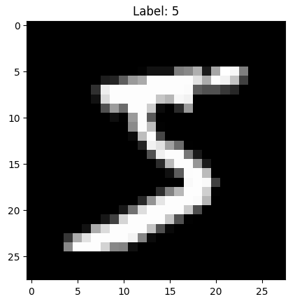
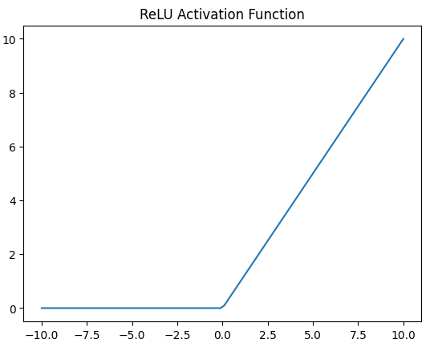
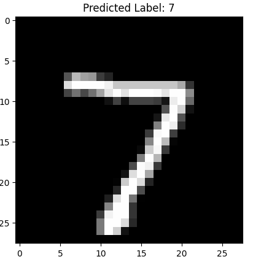
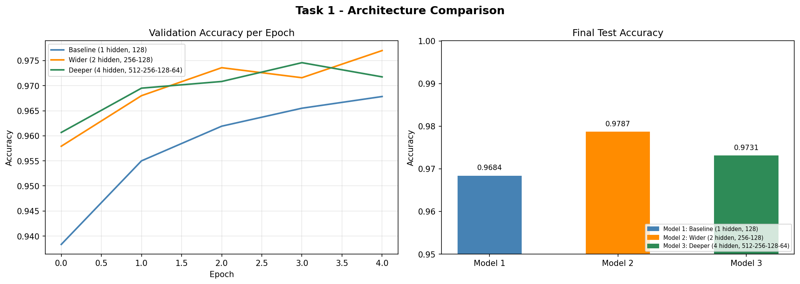
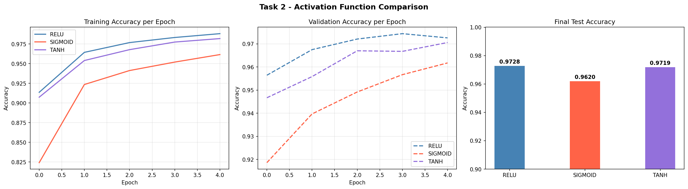
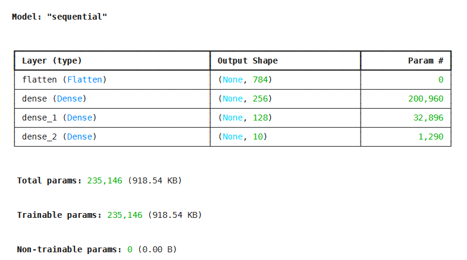
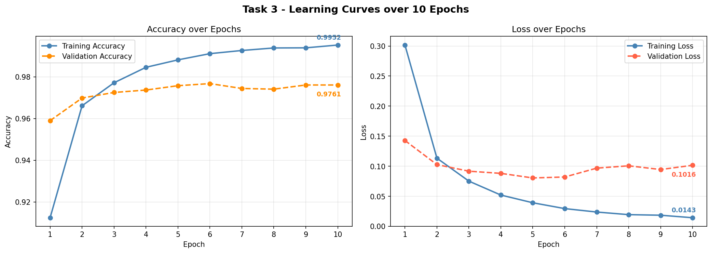

# Section 6 Day 5 - Introduction to Neural Networks and Deep Learning

## Objective:
Day 5 introduces the fundamental concepts of neural networks and deep learning. We will build a simple feedforward neural network to classify handwritten digits using the MNIST dataset. This will be our first hands-on experience with deep learning frameworks like TensorFlow.

## Learning Outcomes:
By the end of the day, we will:¶

    Understand the structure and working of a basic neural network.
    Learn about activation functions, layers, and backpropagation.
    Build a simple neural network for image classification.
    Train and evaluate the model on the MNIST dataset.
    Be familiar with popular deep learning libraries such as TensorFlow.


## Content

32. [Introduction to Neural Networks and Deep Learning](#32-introduction-to-neural-networks-and-deep-learning)
33. [What is Neural Network?](#33-what-is-neural-network)
34. [Introduction to Deep Learning Frameworks](#34-introduction-to-deep-learning-frameworks)
35. [MNIST Dataset Overview](#35-mnist-dataset-overview)
36. [Building a Simple Neural Network for MNIST](#36-building-a-simple-neural-network-for-mnist)
37. [Evaluating the Neural Network](#37-evaluating-the-neural-network)
38. [Understanding Activation Functions](#38-understanding-activation-functions)
39. [Hand-on Project: Handwritten Digit Classification using Neural Networks](#39-hand-on-project-handwritten-digit-classification-using-neural-networks)

[Assignment 5: Day 5: Coding Exercise](#assignment-5-day-5-coding-exercise)


<br>
<br>

## 32. Introduction to Neural Networks and Deep Learning

[⬆ Back to content](#content)

- Key Concepts
  - Weights and Biases
  - Activation Functions
  - Backpropagation

[⬆ Back to content](#content)

## 33. What is Neural Network?

[⬆ Back to content](#content)

A neural network is a series of connected layers of nodes, or something called as neurons, that are modeled to mimic the human brain. 

It consists of three things. 
  - First is the input layer where the input data enters the network.
  - Then we have the hidden layers layers between input and output layers where computation happens
  - and then finally output layer which provides the final result or the prediction.

Now some of the key concepts in neural network are weights and biases, which are parameters of the network that are learned during training. We have activation functions functions like ReLU, sigmoid, and softmax that decide the output of a neuron.

And then finally we have the back propagation, the process of updating the weights using the gradient of the errors, which is also called as loss.

[⬆ Back to content](#content)

## 34. Introduction to Deep Learning Frameworks

[⬆ Back to content](#content)

TensorFlow or PyTorch? 

We have two very prominent ones which are TensorFlow or PyTorch. Now both frameworks are widely used for deep learning.

TensorFlow is a high level library with easy integration into production systems, whereas PyTorch is known for its dynamic computational graph and being more pythonic and flexible for research.

For this day, we will use TensorFlow as its beginner friendly.

[⬆ Back to content](#content)

## 35. MNIST Dataset Overview

[⬆ Back to content](#content)

mNIST or mNIST data overview.

What is mNIST? - The mNIST data set consists of 28 by 28 pixel grayscale images of handwritten digits, from 0 to 9. It is a common data set for image classification task in deep learning.

Now let's do a breakdown of this data set.
- This training set includes 60,000 images of digits.
- The test set includes 10,000 images of digits.

Here is an example where I can run this. First thing that you need is you need TensorFlow for this.

So I'm going to say pip.

Pip install TensorFlow and run this.

```python
pip install tensorflow
```
Play: shift + enter<br>


```python
import matplotlib.pyplot as plt
from tensorflow.keras.datasets import mnist

(X_train, y_train), (X_test, y_test) = mnist.load_data()
plt.imshow(X_train[0], cmap='gray')
plt.title(f'Label: {y_train[0]}')
plt.show()
```
Play: shift + enter<br>
Result:<br>


<br>
<br>

And it did pick up an image and it labeled it as five. As you can see it picked one of them and then displayed the image for it. 

So you can kind of change that numbers and then play around with it and look at the data set. But that's what mNIST data set brings you.

[⬆ Back to content](#content)

## 36. Building a Simple Neural Network for MNIST

[⬆ Back to content](#content)

We have divided this into four different steps.
- The first step that goes into building a simple neural network is data pre-processing. Before feeding the data into the network, we need to reshape and normalize the pixel values.
  
Step 1: Data Preprocessing 
- reshape the data to samples of 28 by 28 by one for TensorFlow
- The next thing that I want to do in this step one is to normalize pixel values which are 0 to 2, 55 to 0 to one

Step 2: Define the Neural Network Architecture
- define the neural network architecture - build a simple feedforward neural network with an input layer one for more hidden layers with ReLU activation and an output layer with softmax for multi-class classification.

Step 3: Compile the Model
- The compilation specifies the optimizer loss function and evaluation metric. We will use categorical cross entropy for multi-class classification and Adam optimizer for fast convergence.

Step 4: Train the Model
- train the model for five epochs with a batch size of 128, monitoring the accuracy and loss on both the training and validation data sets.

```python
# Step 1
## reshape
X_train = X_train.reshape(X_train.shape[0], 28, 28, 1).atype('float32')
X_test = X_test.reshape(X_test.shape[0], 28, 28, 1).atype('float32')

## normalize
X_train /= 255          # image spectrum or color spectrum equal to 255.
X_test /= 255           # So that will give me a value between 0 to 1.

# Step 2
## define the neural network architecture
from tensorflow.keras.models import Sequential
from tensorflow.keras.layers import Dense, Flatten

### initializing the model
model = Sequential()

### input layer which is flatten the 28 by 28 images into a 1D vector.
model.add(Flatten(input_shape(28, 28, 1)))

### set the hidden layer with 128 neurons and ReLU activation.
model.add(Dense(128, activation='relu'))

### output layer where ten neurons one for each digit and softmax activation.
model.add(Dense(10, activation='softmax'))

# Step 3
## compile the model
model.compile(optimizer='adam', loss='sparse_categorical_crossentropy', metric=['accuracy'])

# Step 4
## train the model
model.fit(X_train, y_train, epochs=5, batch_size=128, validation_split=0.2)
```


[⬆ Back to content](#content)

## 37. Evaluating the Neural Network

[⬆ Back to content](#content)

- Model Evaluation
- Making Predictions - use the trained model to make predictions on new images and visualize them.

after training evaluating the model on the test data set to see how well it generalizes.

```python
# Model Evaluation
test_loss, test_accuracy = model.evaluate(X_test, y_test)
print(f"Test Accuracy: {test_accuracy}")

# Making Predictions
## make predictions on the test data set.
predictions = model.predict(X_test)

## show the first test image and its predicted label
plt.imshow(X_test[0].reshape(28,28), cmap='gray')
plt.title(f"Predicted Label: {predictions[0].argmax()}")

## display
plt.show()
```


[⬆ Back to content](#content)

## 38. Understanding Activation Functions

[⬆ Back to content](#content)

Activation Functions - activation functions include ReLU and softmax
- ReLU is rectified linear unit. The most common activation function that is used and is defined as f(x) = max(0,x) and introduces non-linearity in the model, whereas softmax.
- Softmax on the other hand, converts raw outputs, which is logits, into probabilities for multi-class classification.

**Example ReLU**
```python
import numpy as np
import matplotlib.pyplot as plt

x = np.linspace(-10, 10, 100)
y = np.maximum(0,x)
plt.plot(x, y)
plt.title('ReLU Activation Function')
plt.show()
```

Play: shift + enter<br>
Result:<br>


<br>
<br>

[⬆ Back to content](#content)

## 39. Hand-on Project: Handwritten Digit Classification using Neural Networks

[⬆ Back to content](#content)

Task:

    Build a neural network to classify handwritten digits using the MNIST dataset.
    The network should contain at least one hidden layer with ReLU activation and an output layer with Softmax for multi-class classification.

Steps:

    Preprocess the data by normalizing the pixel values and reshaping the input.
    Define the neural network architecture, using at least one hidden layer and an output layer for 10-class classification.
    Train the model and monitor the accuracy and loss during training.
    Evaluate the model on the test dataset and visualize some predictions.
    Make predictions on the test data

```python
from tensorflow.keras.datasets import mnist
from tensorflow.keras.models import Sequential
from tensorflow.keras.layers import Dense, Flatten
from tensorflow.keras.utils import to_categorical

# Preprocess the data by normalizing the pixel values and reshaping the input
(X_train, y_train), (X_test, y_test) = mnist.load_data()
X_train = X_train.reshape(X_train.shape[0], 28, 28, 1).astype('float32') / 255
X_test = X_test.reshape(X_test.shape[0], 28, 28, 1).astype('float32') / 255

# Define/Build the neural network architecture, using at least one hidden layer and an output layer for 10-class classification
model = Sequential()
model.add(Flatten(input_shape=(28,28,1)))
model.add(Dense(128, activation='relu'))
model.add(Dense(10, activation='softmax'))

# Train/compile the model and monitor the accuracy and loss during training
model.compile(optimizer='adam', loss='sparse_categorical_crossentropy', metrics=['accuracy'])
model.fit(X_train, y_train, epochs=5, batch_size=128, validation_split=0.2)

# Evaluate the model on the test dataset and visualize some predictions
test_loss, test_accuracy = model.evaluate(X_test, y_test)
print(f"Accuracy: {test_accuracy}")

# make predictions on the test data
import numpy as np
import matplotlib.pyplot as plt
predictions = model.predict(X_test)
plt.imshow(X_test[0].reshape(28,28), cmap='gray')
plt.title(f"Predicted Label: {np.argmax(predictions[0])}")
plt.show()
```

Play: shift + enter<br>
Result:<br>


<br>
<br>

This project introduces you to building and training a neural network for image classification using the MNIST data set.

It includes data processing, pre-processing, defining the network, training, evaluation and making predictions

[⬆ Back to content](#content)

## Assignment 5: Day 5: Coding Exercise

[⬆ Back to content](#content)

**TASK 1**
```python
"""
Assignment 5 - Task 1
Modify the architecture by adding more hidden layers and neurons.
See how it affects accuracy.
"""

import tensorflow as tf
from tensorflow.keras.datasets import mnist
from tensorflow.keras.models import Sequential
from tensorflow.keras.layers import Dense, Flatten
import matplotlib.pyplot as plt

# Clear any cached Keras state from previous runs
tf.keras.backend.clear_session()

# ── Load & preprocess data ──────────────────────────────────────────────────
(X_train, y_train), (X_test, y_test) = mnist.load_data()
X_train = X_train.reshape(X_train.shape[0], 28, 28, 1).astype('float32') / 255
X_test  = X_test.reshape(X_test.shape[0],  28, 28, 1).astype('float32') / 255


# ── Helper: build, train, and evaluate a model ──────────────────────────────
def build_and_train(layers_config, epochs=5):
    """
    layers_config: list of (units, activation) tuples for hidden layers.
    The output layer (10 neurons, softmax) is added automatically.
    """
    model = Sequential()
    model.add(Flatten(input_shape=(28, 28, 1)))

    for units, activation in layers_config:
        model.add(Dense(units, activation=activation))

    model.add(Dense(10, activation='softmax'))

    model.compile(
        optimizer='adam',
        loss='sparse_categorical_crossentropy',
        metrics=['accuracy']
    )

    history = model.fit(
        X_train, y_train,
        epochs=epochs,
        batch_size=128,
        validation_split=0.2,
        verbose=1
    )

    test_loss, test_acc = model.evaluate(X_test, y_test, verbose=0)
    return history, test_acc


# ── Define three architectures to compare ───────────────────────────────────
configs = [
    {
        'label': 'Baseline (1 hidden, 128)',
        'layers': [(128, 'relu')]
    },
    {
        'label': 'Wider (2 hidden, 256-128)',
        'layers': [(256, 'relu'), (128, 'relu')]
    },
    {
        'label': 'Deeper (4 hidden, 512-256-128-64)',
        'layers': [(512, 'relu'), (256, 'relu'), (128, 'relu'), (64, 'relu')]
    },
]

# ── Train all models ─────────────────────────────────────────────────────────
histories  = []
accuracies = []

for cfg in configs:
    print(f"\n{'='*50}")
    print(f"Training: {cfg['label']}")
    tf.keras.backend.clear_session()   # reset between models to avoid name collisions
    hist, acc = build_and_train(cfg['layers'], epochs=5)
    histories.append(hist)
    accuracies.append(acc)
    print(f"Test Accuracy: {acc:.4f}")


# ── Plot results ─────────────────────────────────────────────────────────────
colors = ['steelblue', 'darkorange', 'seagreen']
labels = [cfg['label'] for cfg in configs]

fig, axes = plt.subplots(1, 2, figsize=(14, 5))
fig.suptitle('Task 1 - Architecture Comparison', fontsize=14, fontweight='bold')

# Left: validation accuracy per epoch
for hist, label, color in zip(histories, labels, colors):
    axes[0].plot(hist.history['val_accuracy'], label=label, color=color, linewidth=2)
axes[0].set_title('Validation Accuracy per Epoch')
axes[0].set_xlabel('Epoch')
axes[0].set_ylabel('Accuracy')
axes[0].legend(fontsize=8)
axes[0].grid(True, alpha=0.3)

# Right: final test accuracy bar chart
bars = axes[1].bar(
    [f'Model {i+1}' for i in range(len(accuracies))],
    accuracies,
    color=colors,
    width=0.5
)
axes[1].set_title('Final Test Accuracy')
axes[1].set_ylabel('Accuracy')
axes[1].set_ylim(0.95, 1.0)
for bar, acc in zip(bars, accuracies):
    axes[1].text(
        bar.get_x() + bar.get_width() / 2,
        bar.get_height() + 0.001,
        f'{acc:.4f}',
        ha='center', va='bottom', fontsize=9
    )
axes[1].legend(
    [plt.Rectangle((0, 0), 1, 1, color=c) for c in colors],
    [f'Model {i+1}: {l}' for i, l in enumerate(labels)],
    fontsize=7,
    loc='lower right'
)

plt.tight_layout()
plt.savefig('task1_architecture_comparison.png', dpi=150, bbox_inches='tight')
plt.show()
print("\nPlot saved as task1_architecture_comparison.png")
```
Play: shift + enter<br>
Result:<br>


<br>
<br>


**TASK 2**
```python
"""
Assignment 5 - Task 2
Experiment with different activation functions like Sigmoid in the hidden layers.
"""

import tensorflow as tf
from tensorflow.keras.datasets import mnist
from tensorflow.keras.models import Sequential
from tensorflow.keras.layers import Dense, Flatten
import matplotlib.pyplot as plt

tf.keras.backend.clear_session()

# ── Load & preprocess data ──────────────────────────────────────────────────
(X_train, y_train), (X_test, y_test) = mnist.load_data()
X_train = X_train.reshape(X_train.shape[0], 28, 28, 1).astype('float32') / 255
X_test  = X_test.reshape(X_test.shape[0],  28, 28, 1).astype('float32') / 255


# ── Helper: build, train, and evaluate a model ──────────────────────────────
def build_and_train(activation, epochs=5):
    """
    Builds a 2-hidden-layer network using the given activation function.
    Architecture is kept identical across all runs so only the
    activation function changes.
    """
    model = Sequential()
    model.add(Flatten(input_shape=(28, 28, 1)))
    model.add(Dense(256, activation=activation))
    model.add(Dense(128, activation=activation))
    model.add(Dense(10,  activation='softmax'))   # output always softmax

    model.compile(
        optimizer='adam',
        loss='sparse_categorical_crossentropy',
        metrics=['accuracy']
    )

    history = model.fit(
        X_train, y_train,
        epochs=epochs,
        batch_size=128,
        validation_split=0.2,
        verbose=1
    )

    test_loss, test_acc = model.evaluate(X_test, y_test, verbose=0)
    return history, test_acc


# ── Activation functions to compare ─────────────────────────────────────────
activations = ['relu', 'sigmoid', 'tanh']

histories  = []
accuracies = []

for act in activations:
    print(f"\n{'='*50}")
    print(f"Training with activation: {act.upper()}")
    tf.keras.backend.clear_session()
    hist, acc = build_and_train(act, epochs=5)
    histories.append(hist)
    accuracies.append(acc)
    print(f"Test Accuracy ({act}): {acc:.4f}")


# ── Plot results ─────────────────────────────────────────────────────────────
colors = ['steelblue', 'tomato', 'mediumpurple']

fig, axes = plt.subplots(1, 3, figsize=(18, 5))
fig.suptitle('Task 2 - Activation Function Comparison', fontsize=14, fontweight='bold')

# Left: training accuracy
for hist, act, color in zip(histories, activations, colors):
    axes[0].plot(hist.history['accuracy'], label=act.upper(), color=color, linewidth=2)
axes[0].set_title('Training Accuracy per Epoch')
axes[0].set_xlabel('Epoch')
axes[0].set_ylabel('Accuracy')
axes[0].legend()
axes[0].grid(True, alpha=0.3)

# Middle: validation accuracy
for hist, act, color in zip(histories, activations, colors):
    axes[1].plot(hist.history['val_accuracy'], label=act.upper(), color=color,
                 linewidth=2, linestyle='--')
axes[1].set_title('Validation Accuracy per Epoch')
axes[1].set_xlabel('Epoch')
axes[1].set_ylabel('Accuracy')
axes[1].legend()
axes[1].grid(True, alpha=0.3)

# Right: final test accuracy bar chart
bars = axes[2].bar(
    [act.upper() for act in activations],
    accuracies,
    color=colors,
    width=0.4
)
axes[2].set_title('Final Test Accuracy')
axes[2].set_ylabel('Accuracy')
axes[2].set_ylim(0.90, 1.0)
for bar, acc in zip(bars, accuracies):
    axes[2].text(
        bar.get_x() + bar.get_width() / 2,
        bar.get_height() + 0.001,
        f'{acc:.4f}',
        ha='center', va='bottom', fontsize=10, fontweight='bold'
    )

plt.tight_layout()
plt.savefig('task2_activation_comparison.png', dpi=150, bbox_inches='tight')
plt.show()
print("\nPlot saved as task2_activation_comparison.png")
```
Play: shift + enter<br>
Result:<br>


<br>
<br>


**TASK 3**
```python
"""
Assignment 5 - Task 3
Try training for 10 epochs and plot the loss and accuracy over time
to observe the learning curve.
"""

import tensorflow as tf
from tensorflow.keras.datasets import mnist
from tensorflow.keras.models import Sequential
from tensorflow.keras.layers import Dense, Flatten
import matplotlib.pyplot as plt

tf.keras.backend.clear_session()

# ── Load & preprocess data ──────────────────────────────────────────────────
(X_train, y_train), (X_test, y_test) = mnist.load_data()
X_train = X_train.reshape(X_train.shape[0], 28, 28, 1).astype('float32') / 255
X_test  = X_test.reshape(X_test.shape[0],  28, 28, 1).astype('float32') / 255

# ── Build the model ──────────────────────────────────────────────────────────
model = Sequential()
model.add(Flatten(input_shape=(28, 28, 1)))
model.add(Dense(256, activation='relu'))
model.add(Dense(128, activation='relu'))
model.add(Dense(10,  activation='softmax'))

model.compile(
    optimizer='adam',
    loss='sparse_categorical_crossentropy',
    metrics=['accuracy']
)

model.summary()

# ── Train for 10 epochs ──────────────────────────────────────────────────────
EPOCHS = 10

history = model.fit(
    X_train, y_train,
    epochs=EPOCHS,
    batch_size=128,
    validation_split=0.2,
    verbose=1
)

# ── Evaluate on test set ─────────────────────────────────────────────────────
test_loss, test_acc = model.evaluate(X_test, y_test, verbose=0)
print(f"\nFinal Test Accuracy : {test_acc:.4f}")
print(f"Final Test Loss     : {test_loss:.4f}")

# ── Plot learning curves ─────────────────────────────────────────────────────
epochs_range = range(1, EPOCHS + 1)

fig, axes = plt.subplots(1, 2, figsize=(14, 5))
fig.suptitle('Task 3 - Learning Curves over 10 Epochs', fontsize=14, fontweight='bold')

# Left: Accuracy
axes[0].plot(epochs_range, history.history['accuracy'],
             label='Training Accuracy', color='steelblue', linewidth=2, marker='o')
axes[0].plot(epochs_range, history.history['val_accuracy'],
             label='Validation Accuracy', color='darkorange', linewidth=2,
             marker='o', linestyle='--')
axes[0].set_title('Accuracy over Epochs')
axes[0].set_xlabel('Epoch')
axes[0].set_ylabel('Accuracy')
axes[0].set_xticks(epochs_range)
axes[0].legend()
axes[0].grid(True, alpha=0.3)

# Annotate final values
axes[0].annotate(f"{history.history['accuracy'][-1]:.4f}",
                 xy=(EPOCHS, history.history['accuracy'][-1]),
                 xytext=(-30, 8), textcoords='offset points',
                 color='steelblue', fontsize=9, fontweight='bold')
axes[0].annotate(f"{history.history['val_accuracy'][-1]:.4f}",
                 xy=(EPOCHS, history.history['val_accuracy'][-1]),
                 xytext=(-30, -16), textcoords='offset points',
                 color='darkorange', fontsize=9, fontweight='bold')

# Right: Loss
axes[1].plot(epochs_range, history.history['loss'],
             label='Training Loss', color='steelblue', linewidth=2, marker='o')
axes[1].plot(epochs_range, history.history['val_loss'],
             label='Validation Loss', color='tomato', linewidth=2,
             marker='o', linestyle='--')
axes[1].set_title('Loss over Epochs')
axes[1].set_xlabel('Epoch')
axes[1].set_ylabel('Loss')
axes[1].set_xticks(epochs_range)
axes[1].legend()
axes[1].grid(True, alpha=0.3)

# Annotate final values
axes[1].annotate(f"{history.history['loss'][-1]:.4f}",
                 xy=(EPOCHS, history.history['loss'][-1]),
                 xytext=(-30, 8), textcoords='offset points',
                 color='steelblue', fontsize=9, fontweight='bold')
axes[1].annotate(f"{history.history['val_loss'][-1]:.4f}",
                 xy=(EPOCHS, history.history['val_loss'][-1]),
                 xytext=(-30, -16), textcoords='offset points',
                 color='tomato', fontsize=9, fontweight='bold')

plt.tight_layout()
plt.savefig('task3_learning_curves.png', dpi=150, bbox_inches='tight')
plt.show()
print("\nPlot saved as task3_learning_curves.png")
```
Play: shift + enter<br>
Result:<br>


<br>
<br>


<br>
<br>

## Instructor Examples

**Task1**
```python
# Import necessary libraries
import tensorflow as tf
from tensorflow.keras import layers, models
from tensorflow.keras.datasets import mnist
from tensorflow.keras.utils import to_categorical

# Load the MNIST dataset
(X_train, y_train), (X_test, y_test) = mnist.load_data()

# Preprocess the data
# Flatten 28x28 images into 784-dimensional vectors and normalize pixel values
X_train = X_train.reshape((X_train.shape[0], 28 * 28)).astype('float32') / 255
X_test = X_test.reshape((X_test.shape[0], 28 * 28)).astype('float32') / 255

# Convert labels to one-hot encoding
y_train = to_categorical(y_train)
y_test = to_categorical(y_test)

# Step 1: Define the baseline neural network architecture with one hidden layer
def build_baseline_model():
    model = models.Sequential()
    model.add(layers.Dense(128, activation='relu', input_shape=(28 * 28,)))
    model.add(layers.Dense(10, activation='softmax'))  # Output layer
    model.compile(optimizer='adam', loss='categorical_crossentropy', metrics=['accuracy'])
    return model

# Step 2: Define the modified neural network architecture with more hidden layers and neurons
def build_modified_model():
    model = models.Sequential()
    model.add(layers.Dense(256, activation='relu', input_shape=(28 * 28,)))  # First hidden layer
    model.add(layers.Dense(128, activation='relu'))  # Second hidden layer
    model.add(layers.Dense(64, activation='relu'))   # Third hidden layer
    model.add(layers.Dense(10, activation='softmax'))  # Output layer
    model.compile(optimizer='adam', loss='categorical_crossentropy', metrics=['accuracy'])
    return model

# Step 3: Train and evaluate the baseline model
baseline_model = build_baseline_model()
history_baseline = baseline_model.fit(X_train, y_train, epochs=10, batch_size=128, validation_data=(X_test, y_test), verbose=2)
baseline_loss, baseline_accuracy = baseline_model.evaluate(X_test, y_test, verbose=0)

# Step 4: Train and evaluate the modified model
modified_model = build_modified_model()
history_modified = modified_model.fit(X_train, y_train, epochs=10, batch_size=128, validation_data=(X_test, y_test), verbose=2)
modified_loss, modified_accuracy = modified_model.evaluate(X_test, y_test, verbose=0)

# Output the accuracy for both models
print(f"Baseline Model Accuracy: {baseline_accuracy * 100:.2f}%")
print(f"Modified Model Accuracy: {modified_accuracy * 100:.2f}%")
```


**Task 2**
```python
# Import necessary libraries
import tensorflow as tf
from tensorflow.keras import layers, models
from tensorflow.keras.datasets import mnist
from tensorflow.keras.utils import to_categorical

# Load the MNIST dataset
(X_train, y_train), (X_test, y_test) = mnist.load_data()

# Preprocess the data
# Flatten 28x28 images into 784-dimensional vectors and normalize pixel values
X_train = X_train.reshape((X_train.shape[0], 28 * 28)).astype('float32') / 255
X_test = X_test.reshape((X_test.shape[0], 28 * 28)).astype('float32') / 255

# Convert labels to one-hot encoding
y_train = to_categorical(y_train)
y_test = to_categorical(y_test)

# Step 1: Define a neural network with ReLU activation
def build_relu_model():
    model = models.Sequential()
    model.add(layers.Dense(128, activation='relu', input_shape=(28 * 28,)))  # Hidden layer with ReLU
    model.add(layers.Dense(10, activation='softmax'))  # Output layer
    model.compile(optimizer='adam', loss='categorical_crossentropy', metrics=['accuracy'])
    return model

# Step 2: Define a neural network with Sigmoid activation
def build_sigmoid_model():
    model = models.Sequential()
    model.add(layers.Dense(128, activation='sigmoid', input_shape=(28 * 28,)))  # Hidden layer with Sigmoid
    model.add(layers.Dense(10, activation='softmax'))  # Output layer
    model.compile(optimizer='adam', loss='categorical_crossentropy', metrics=['accuracy'])
    return model

# Step 3: Train and evaluate the model with ReLU activation
relu_model = build_relu_model()
history_relu = relu_model.fit(X_train, y_train, epochs=10, batch_size=128, validation_data=(X_test, y_test), verbose=2)
relu_loss, relu_accuracy = relu_model.evaluate(X_test, y_test, verbose=0)

# Step 4: Train and evaluate the model with Sigmoid activation
sigmoid_model = build_sigmoid_model()
history_sigmoid = sigmoid_model.fit(X_train, y_train, epochs=10, batch_size=128, validation_data=(X_test, y_test), verbose=2)
sigmoid_loss, sigmoid_accuracy = sigmoid_model.evaluate(X_test, y_test, verbose=0)

# Output the accuracy for both models
print(f"ReLU Model Accuracy: {relu_accuracy * 100:.2f}%")
print(f"Sigmoid Model Accuracy: {sigmoid_accuracy * 100:.2f}%")
```

**Task 3**
```python
# Import necessary libraries
import tensorflow as tf
from tensorflow.keras import layers, models
from tensorflow.keras.datasets import mnist
from tensorflow.keras.utils import to_categorical
import matplotlib.pyplot as plt

# Load the MNIST dataset
(X_train, y_train), (X_test, y_test) = mnist.load_data()

# Preprocess the data
# Flatten 28x28 images into 784-dimensional vectors and normalize pixel values
X_train = X_train.reshape((X_train.shape[0], 28 * 28)).astype('float32') / 255
X_test = X_test.reshape((X_test.shape[0], 28 * 28)).astype('float32') / 255

# Convert labels to one-hot encoding
y_train = to_categorical(y_train)
y_test = to_categorical(y_test)

# Define the neural network model with ReLU activation
def build_model():
    model = models.Sequential()
    model.add(layers.Dense(128, activation='relu', input_shape=(28 * 28,)))  # Hidden layer with ReLU
    model.add(layers.Dense(10, activation='softmax'))  # Output layer
    model.compile(optimizer='adam', loss='categorical_crossentropy', metrics=['accuracy'])
    return model

# Build and train the model for 10 epochs
model = build_model()
history = model.fit(X_train, y_train, epochs=10, batch_size=128, validation_data=(X_test, y_test), verbose=2)

# Plot the loss and accuracy over the epochs
def plot_learning_curves(history):
    # Plot accuracy
    plt.figure(figsize=(12, 5))

    # Plot Accuracy over time
    plt.subplot(1, 2, 1)
    plt.plot(history.history['accuracy'], label='Training Accuracy')
    plt.plot(history.history['val_accuracy'], label='Validation Accuracy')
    plt.title('Accuracy over 10 epochs')
    plt.xlabel('Epochs')
    plt.ylabel('Accuracy')
    plt.legend()

    # Plot Loss over time
    plt.subplot(1, 2, 2)
    plt.plot(history.history['loss'], label='Training Loss')
    plt.plot(history.history['val_loss'], label='Validation Loss')
    plt.title('Loss over 10 epochs')
    plt.xlabel('Epochs')
    plt.ylabel('Loss')
    plt.legend()

    plt.show()

# Call the function to plot the learning curves
plot_learning_curves(history)
```

[⬆ Back to content](#content)