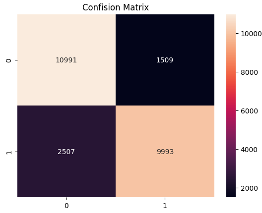
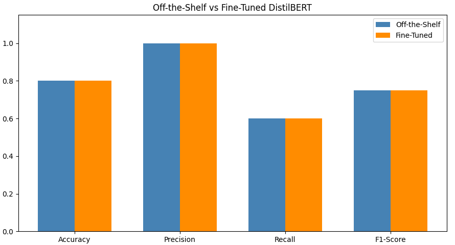
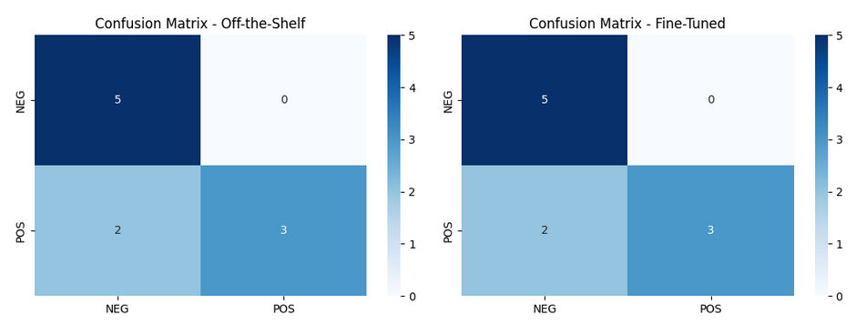
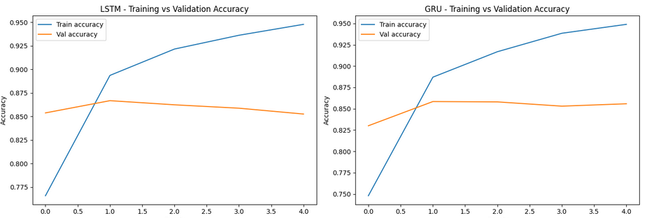
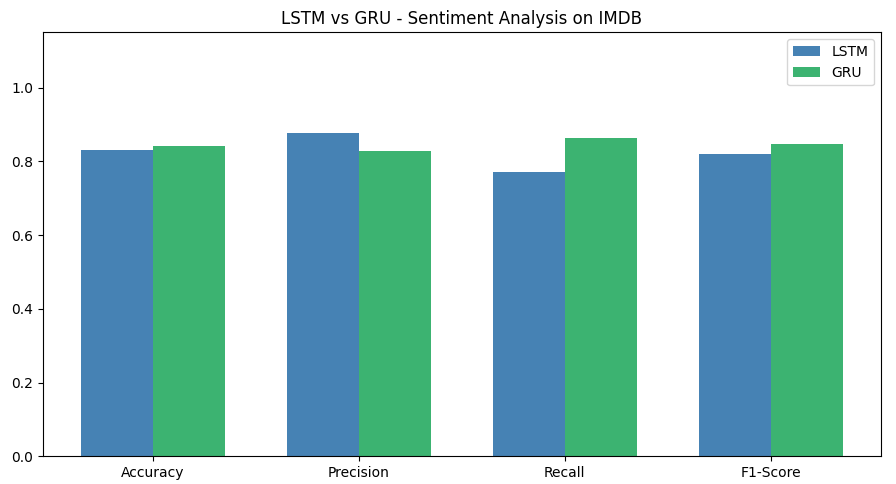
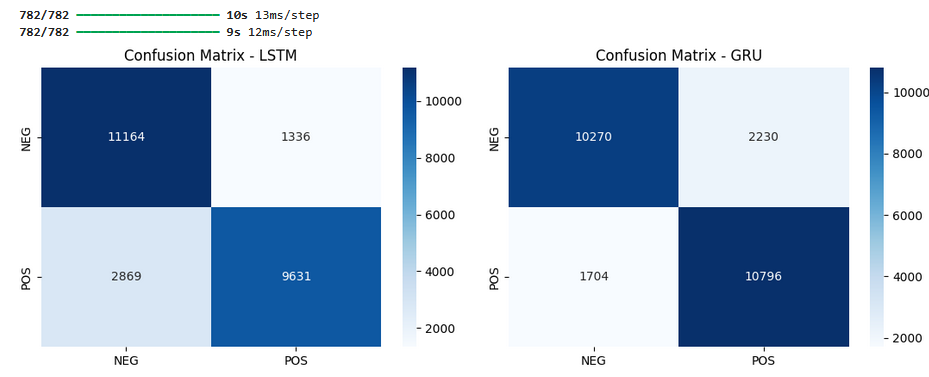
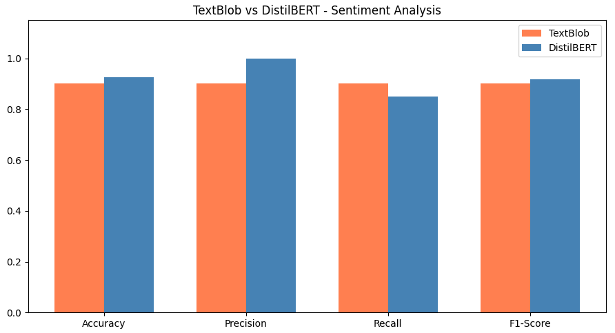
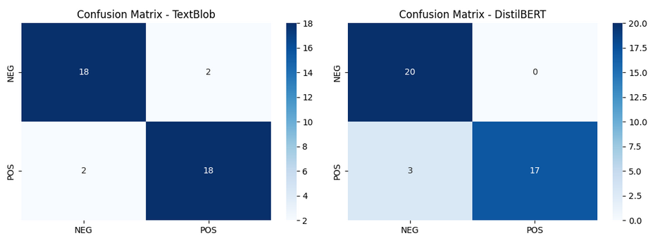
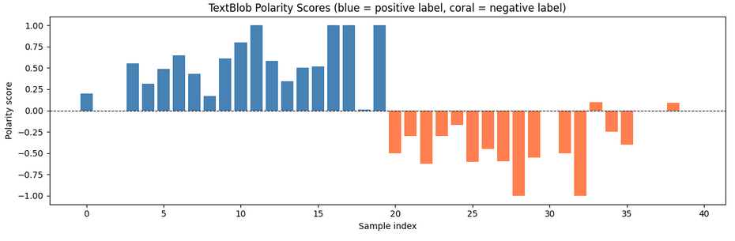

Section 7 Day 6 - Building a Sentiment Analisys Model Using Natural Language Processing

## Objective:
Day 6 introduces Natural Language Processing (NLP) and focuses on text classification through sentiment analysis. We will build a sentiment analysis model that classifies text as positive or negative using a pre-trained model from Hugging Face.

## Learning Outcomes:
By the end of the day, we will:

    Understand the basics of NLP and its importance in AI.
    Learn text preprocessing techniques such as tokenization, stemming, and vectorization.
    Build a sentiment analysis model using a pre-trained NLP model.
    Evaluate the model using metrics such as accuracy and F1-score.
    Understand the concept of transfer learning for NLP tasks.


## Content

40.  [Introduction to Day 6: Building a Sentiment Analisys Model Using NLP](#40-introduction-to-day-6-building-a-sentiment-analisys-model-using-nlp)
41.  [Introducing to Natural Language Processing NLP](#41-introducing-to-natural-language-processing-nlp)
42.  [Sentiment Analisys: Understanding Text Classification](#42-sentiment-analisys-understanding-text-classification)
43.  [Text Processing](#43-text-processing)
44.  [Using Pre-traained Model for NLP - Hugging Face](#44-using-pre-traained-model-for-nlp---hugging-face)
45.  [Building a Sentiment Analisys Model with TensorFlow](#45-building-a-sentiment-analisys-model-with-tensorflow)
46.  [Evaluating the Model](#46-evaluating-the-model)
47.  [Hand-On Project: Sentiment Analisys Using Pre-trained NLP Models](#47-hand-on-project-sentiment-analisys-using-pre-trained-nlp-models)

[Assigment 6: Day 6: Coding Exercise](#assigment-6-day-6-coding-exercise)


<br>
<br>

## 40. Introduction to Day 6: Building a Sentiment Analisys Model Using NLP

[⬆ Back to content](#content)

Our objective for day six introduces Natural Language Processing, or NLP, and focuses on text classification through sentiment analysis. We will build a sentiment analysis model that classifies text as positive or negative, using a pre-trained model from hugging face.

Our learning objective for day six is by the end of the day, we will understand the basics of NLP and its importance in AI.
- Learn text pre-processing techniques such as tokenization, stemming and vectorization.
- Build a sentiment analysis model using a pre-trained NLP model.
- Evaluate the model using the metrics such as accuracy and F1 score.
- And finally understand the concept of transfer learning for NLP tasks.

[⬆ Back to content](#content)


## 41. Introducing to Natural Language Processing NLP

[⬆ Back to content](#content)

What is NLP?

NLP is a branch of AI that enables machines to understand, interpret and manipulate human language. It plays a crucial role in applications like chatbots, sentiment analysis, machine translation and more.

Some of the common NLP tasks include text classification, where you are classifying a document or sentence. Example if something is spam or not. Spam something is positive versus negative sentiment. Then we have named entity recognition ner where you are identifying entities like names, locations and dates.

Next we have machine translation translating text from one language to another. 

And finally we have speech recognition converting spoken words into text.

[⬆ Back to content](#content)

## 42. Sentiment Analisys: Understanding Text Classification

[⬆ Back to content](#content)

Understanding text classification.

Now first, what is sentiment analysis?

Sentiment analysis is the process of determining whether a piece of text conveys positive, negative, or neutral sentiment. It is widely used in applications such as customer feedback, social media monitoring, and product reviews. 

You can think of an example where I can say I am having an amazing day, which is positive. I can say I am having a horrible day negative. And I can also say it's an amazing day, but work is where I have to be so I don't like it much. So it's a neutral state sentiment where I am saying everything is good, but at the same time everything is bad.

For the problem statement, we will build a sentiment analysis model that classifies movie reviews as positive or negative using a pre-trained model. We will be doing that in our hands on section, so stay tuned.

[⬆ Back to content](#content)

## 43. Text Processing

[⬆ Back to content](#content)

In this particular section we are going to look at three different steps.


Step 1: Tokenization
Step 2: Stemming and Lemmatization
Step 3: Vectorization
So for vectorization a text data needs to be converted into numerical format to be processed by machine learning algorithms, because machines only understand numbers, not the text. And that's why in AI we kind of vectorize it or change all the text, images, audio, video, whatever it is into numbers.

Now TD, IDF, which is the term frequency, inverse document frequency is a common method or text vector for for text vectorization. So we're going to use that from scikit learn.

Install nltk
    terminal -> pip install nltk

```python
# Step 1: Tokenization
import nltk
nltk.download('punkt_tab')

from nltk.tokenize import word_tokenize
sentense = "I love movie!"
tokens = word_tokenize(sentense)

print(tokens)
```
Play: shift + enter<br>
Result:<br>
['I', 'love', 'movie', '!']


```python
# Step 2: Stemming and Lemmatization
from nltk.stem import PorterStemmer
stemmer = PorterStemmer()
print(stemmer.stem("running"))
print(stemmer.stem("standing"))
```
Play: shift + enter<br>
Result:<br>
run
stand

```python
# Step 3: Vectorization
# Tfidf is term frequency inverse document frequency.
from sklearn.feature_extraction.text import TfidfVectorizer
corpus = ["I love this movie", "This movie is terrible"]
vectorize = TfidfVectorizer()
X = vectorize.fit_transform(corpus)

print(X.toarray())
```
Play: shift + enter<br>
Result:<br>
[[0.         0.70490949 0.50154891 0.         0.50154891]       
 [0.57615236 0.         0.40993715 0.57615236 0.40993715]]

[⬆ Back to content](#content)


## 44. Using Pre-traained Model for NLP - Hugging Face

[⬆ Back to content](#content)


Why Use Pre-trained Models?

Pre-trained models leverage transfer learning where models trained on large data sets are fine tuned on smaller data sets, making them highly effective for various NLP tasks. Some of the steps that will follow for this can be.

Step 1: Install Hugging Face Transformers
Hugging Face provides a repository of pre-trained NLP models that can be used for tasks like sentiment analysis, NER and text classification.

Step 2: Using a Pre-trained Sentiment Analysis Model
classify sample text - it will take that and do sentiment analysis and give me a result of positive in this particular case.

Step 3: Fine-tuning the Model (Optional)
fine tuning is the process of adapting a pre-trained model to a specific task by training it on a smaller data set.

```python
# Step 1: Install Hugging Face Transformers in terminal 
pip install transformers
```


```python
# Step 2: Using a Pre-trained Sentiment Analysis Model
from transformers import pipeline

# load sentiment analysis pipeline.
sentiment_pipeline = pipeline("sentinem-analisys")

# classify sample text - it will take that and do sentiment analysis and give me a result of positive in this particular case.
result = sentiment_pipeline("I love this movie")
```
Play: shift + enter<br>
Result:<br>


```python
# Step 3: Fine-tuning the Model (Optional)
from transformers import Trainer, TrainingArguments

# assuming you have a data set and a pre-trained model ready for fine tuning
# prepares my arguments
training_args = TrainingArguments(output_dir='./result', num_train_epochs=3)

# We have already um trained model that I get from hugging face. 
# We can train it again more or retrain it with my data set that we have.
trainer = Trainer(model, args=training_args, train_dataset=custom_train_dataset, evaluation_dataset=custom_eval_dataset)

trainer.train()
```

[⬆ Back to content](#content)

## 45. Building a Sentiment Analisys Model with TensorFlow

[⬆ Back to content](#content)


Step 1: Load the Dataset
Step 2: Preprocess the Data
Step 3: Define and Train the Model

Install required modules
terminal --> pip install tensorflow tensorflow-datasets
terminal --> pip install importlib-resources

```python
# Step 1: Load the Dataset
import tensorflow_datasets as tfds

# this will return us back the train data and test data and along with some info.
(train_data, test_data), info = tfds.load('imdb_reviews', split=['train', 'test'], with_info=True, as_supervised=True)

## give the tokens by calling the tokenizer
tokenizer = Tokenizer(num_words=1000, oov_token='<00V>')

## fit it on text - get the text from train data and assign it to this tokenizer.
tokenizer.fit_on_texts([text.numpy().decode('utf-8') for text, label in train_data])

## get the sequences
sequences = tokenizer.texts_to_sequences([text.numpy().decode('utf-8') for text, label in train_data])

## pad the sequences on to ensure that uniform length is there
padded_sequences = pad_sequences(sequences, maxlen=120)


# build a simple LSTM based sentiment analysis model using TensorFlow Keras
from tensorflow.keras.models import Sequential
from tensorflow.keras.layers import Embedding, LSTM, Dense

## create model
model = Sequential([
    Embedding(input_dim=1000, output_dim=16, input_length=120),
    LSTM(64),
    Dense(1, activation='sigmoid')
])

import numpy as np
# extract labels
train_labels = np.array([label.numpy() for _, label in train_data])
test_labels  = np.array([label.numpy() for _, label in test_data])

# sequences for test data
test_sequences      = tokenizer.texts_to_sequences([text.numpy().decode('utf-8') for text, label in test_data])
padded_test_sequences = pad_sequences(test_sequences, maxlen=120)

## compile this model
model.compile(optimizer='adam', loss='binary_crossentropy', metrics=['accuracy'])

## finally let's train the model
model.fit(padded_sequences, train_labels, epochs=5, validation_data=(padded_test_sequences, test_labels))
```
Play: shift + enter<br>
Result:<br>
Epoch 1/5
782/782 ━━━━━━━━━━━━━━━━━━━━ 36s 43ms/step - accuracy: 0.7592 - loss: 0.4891 - val_accuracy: 0.8307 - val_loss: 0.3822      
Epoch 2/5
782/782 ━━━━━━━━━━━━━━━━━━━━ 35s 44ms/step - accuracy: 0.8293 - loss: 0.3855 - val_accuracy: 0.8208 - val_loss: 0.4290      
Epoch 3/5
782/782 ━━━━━━━━━━━━━━━━━━━━ 34s 44ms/step - accuracy: 0.8366 - loss: 0.3698 - val_accuracy: 0.8286 - val_loss: 0.3842      
Epoch 4/5
782/782 ━━━━━━━━━━━━━━━━━━━━ 34s 43ms/step - accuracy: 0.8421 - loss: 0.3600 - val_accuracy: 0.8308 - val_loss: 0.3706      
Epoch 5/5
782/782 ━━━━━━━━━━━━━━━━━━━━ 34s 43ms/step - accuracy: 0.8506 - loss: 0.3412 - val_accuracy: 0.8394 - val_loss: 0.3558      

<keras.src.callbacks.history.History at 0x17c3437f620>     

The model was trained successfully

[⬆ Back to content](#content)


## 46. Evaluating the Model

[⬆ Back to content](#content)

- Model Evaluation
So the first thing that we do in model evaluation is we can evaluate the model's performance using the four things four parameters that we've used before which is accuracy, precision recall and F1 score.

- Confusion Matrix


```python
# evaluate a model
from sklearn.metrics import accuracy_score, precision_score, recall_score, f1_score

predictions = model.predict(padded_test_sequences)
predictions = (predictions > 0.5).astype(int)

accuracy = accuracy_score(test_labels, predictions)
precision = precision_score(test_labels, predictions)
recall = recall_score(test_labels, predictions)
f1 = f1_score(test_labels, predictions)

# visualize the confusion matrix for a better understanding of classification
from sklearn.metrics import confusion_matrix
import seaborn as sns
import matplotlib.pyplot as plt

cm = confusion_matrix(test_labels, predictions)

# generate and show heatmap
sns.heatmap(cm, annot=True, fmt='d')
plt.title('Confision Matrix')
plt.show()
```
Play: shift + enter<br>
Result:<br>


<br>
<br>

[⬆ Back to content](#content)

## 47. Hand-On Project: Sentiment Analisys Using Pre-trained NLP Models

[⬆ Back to content](#content)

Task: Build a sentiment analysis model using either Hugging Face’s DistilBERT or TensorFlow’s IMDB Movie Reviews Dataset.
Steps:

    Preprocess the text data by tokenizing and padding sequences.
    Use a pre-trained model for sentiment analysis, or build a model from scratch using TensorFlow.
    Train the model and monitor the performance using accuracy, precision, recall, and F1-score.
    Evaluate and visualize the results, including the confusion matrix.

Install
terminal --> pip install torch

```python
from transformers import pipeline

# load the pre-trained model
sentiment_pipeline = pipeline("sentiment-analysis")

# perform sentiment analysis on a sample text
texts = ["I love this movie", "this movie was terrible"] 
results = sentiment_pipeline(texts)  

for text, result in zip(texts, results):
    print(f"Text: {text} | Sentiment: {result['label']}, Score: {result['score']}")
```
Play: shift + enter<br>
Result:<br>

Text: I love this movie | Sentiment: POSITIVE, Score: 0.9998766183853149
Text: this movie was terrible | Sentiment: NEGATIVE, Score: 0.9996950626373291


Using TensorFlow

```python
import numpy as np
import tensorflow as tf
import tensorflow_datasets as tfds
from tensorflow.keras.preprocessing.text import Tokenizer
from tensorflow.keras.preprocessing.sequence import pad_sequences

## that will give us train data test data and info
(train_data, test_data), info = tfds.load('imdb_reviews', split=['train', 'test'], with_info=True, as_supervised=True)

## tokenizing the and padding the sequences
tokenizer = Tokenizer(num_words=10000)
tokenizer.fit_on_texts([text.numpy().decode('utf-8') for text, label in train_data])


## train sequence
train_sequences = tokenizer.texts_to_sequences([text.numpy().decode('utf-8') for text, label in train_data])
train_padded = pad_sequences(train_sequences, maxlen=120)

## define and compile the LSTM model
model = tf.keras.Sequential([
    tf.keras.layers.Embedding(10000, 16, input_length=120),
    tf.keras.layers.LSTM(64),
    tf.keras.layers.Dense(1, activation='sigmoid')
])

## compile the model
model.compile(optimizer='adam', loss='binary_crossentropy', metrics=['accuracy'])
model.fit(train_padded, np.array([int(label.numpy()) for text, label in train_data]), epochs=5, validation_split=0.2)
```
Play: shift + enter<br>
Result:<br>

Epoch 1/5
625/625 ━━━━━━━━━━━━━━━━━━━━ 21s 31ms/step - accuracy: 0.7566 - loss: 0.4776 - val_accuracy: 0.8592 - val_loss: 0.3418      
Epoch 2/5
625/625 ━━━━━━━━━━━━━━━━━━━━ 19s 30ms/step - accuracy: 0.8885 - loss: 0.2822 - val_accuracy: 0.8500 - val_loss: 0.3319      
Epoch 3/5
625/625 ━━━━━━━━━━━━━━━━━━━━ 18s 29ms/step - accuracy: 0.9176 - loss: 0.2122 - val_accuracy: 0.8656 - val_loss: 0.3494      
Epoch 4/5
625/625 ━━━━━━━━━━━━━━━━━━━━ 18s 29ms/step - accuracy: 0.9388 - loss: 0.1682 - val_accuracy: 0.8572 - val_loss: 0.3453      
Epoch 5/5
625/625 ━━━━━━━━━━━━━━━━━━━━ 18s 29ms/step - accuracy: 0.9537 - loss: 0.1331 - val_accuracy: 0.8626 - val_loss: 0.3980      

<keras.src.callbacks.history.History at 0x2626b9235f0>

[⬆ Back to content](#content)

## Assigment 6: Day 6: Coding Exercise

[⬆ Back to content](#content)

Try to complete these assignments using Jupyter Notebook or your favorite editor in Python
Questions for this assignment

Task 1: Fine-tune a pre-trained model on a custom dataset and compare the results with the off-the-shelf model.
Task 2: Experiment with different architectures like GRU instead of LSTM in TensorFlow for sentiment analysis.
Task 3: Try using the TextBlob library to perform sentiment analysis and compare the results with your model.


**Task 1**      
Step 0 — Install dependencies run once, then restart shell      
terminal --> pip install transformers scikit-learn torch "accelerate>=1.1.0"        


```python
# Step 1 — Custom dataset (40 labelled samples: product/tech reviews)
import pandas as pd
from sklearn.model_selection import train_test_split

custom_data = [
    # POSITIVE
    ("This laptop runs incredibly fast and the battery lasts all day.",           1),
    ("The customer support team resolved my issue within minutes.",               1),
    ("I am blown away by the picture quality of this TV.",                        1),
    ("Shipping was super quick and the packaging was perfect.",                   1),
    ("Absolutely love the new software update, everything feels snappy.",         1),
    ("The restaurant had amazing food and friendly staff.",                       1),
    ("Best purchase I have made all year, totally worth the price.",              1),
    ("The course material is well structured and easy to follow.",                1),
    ("I really enjoyed reading this book, could not put it down.",                1),
    ("The hotel room was clean, spacious, and had a beautiful view.",             1),
    ("Great build quality, the product feels premium in hand.",                   1),
    ("The app works flawlessly on my phone, no crashes at all.",                  1),
    ("Wonderful experience from start to finish, highly recommend.",              1),
    ("The new headphones have outstanding sound and comfort.",                    1),
    ("My kids absolutely love this toy, they play with it every day.",            1),
    ("The seminar was insightful and the speaker was very engaging.",             1),
    ("Delivery arrived ahead of schedule, very impressed.",                       1),
    ("This coffee maker produces the best espresso I have ever tasted.",          1),
    ("The new game mode is incredibly fun and addictive.",                        1),
    ("Excellent value for money, I could not be happier.",                        1),
    # NEGATIVE
    ("The battery dies after just two hours, completely useless.",                0),
    ("Customer service was rude and unhelpful.",                                  0),
    ("The screen cracked after one small drop, terrible quality.",                0),
    ("My order arrived three weeks late and items were damaged.",                 0),
    ("The software update broke half the features I rely on.",                    0),
    ("Food was cold, overpriced, and the waiter ignored us all night.",           0),
    ("Worst product I have ever bought, do not waste your money.",                0),
    ("The instructions are impossible to understand, very frustrating.",          0),
    ("I could not finish the book, it was painfully boring.",                     0),
    ("The room smelled bad and the air conditioning was broken.",                 0),
    ("Flimsy construction, it broke after just one week.",                        0),
    ("The app crashes every time I open it, absolutely dreadful.",                0),
    ("Horrible experience, I will never shop here again.",                        0),
    ("The sound quality is tinny and the fit is uncomfortable.",                  0),
    ("The toy broke on the first day, really disappointed.",                      0),
    ("The presenter was monotone and the content was outdated.",                  0),
    ("The parcel got lost and no one could tell me where it was.",                0),
    ("This coffee machine leaks and is very hard to clean.",                      0),
    ("The new update is full of bugs, unplayable right now.",                     0),
    ("Poor quality for the price, I expected much better.",                       0),
]

df = pd.DataFrame(custom_data, columns=["text", "label"])
train_df, test_df = train_test_split(df, test_size=0.25, random_state=42, stratify=df["label"])
print(f"Train: {len(train_df)}  |  Test: {len(test_df)}")
```
Play: shift + enter<br>
Result:<br>

Train: 30  |  Test: 10


```python
# Step 2 — Evaluate the off-the-shelf model (no fine-tuning)
from transformers import pipeline
from sklearn.metrics import accuracy_score, precision_score, recall_score, f1_score

MODEL_NAME = "distilbert-base-uncased-finetuned-sst-2-english"

ots_pipeline = pipeline("sentiment-analysis", model=MODEL_NAME)

def predict_with_pipeline(pipe, texts):
    results = pipe(texts, truncation=True, max_length=512)
    return [1 if r["label"] == "POSITIVE" else 0 for r in results]

true_labels = test_df["label"].tolist()
ots_preds   = predict_with_pipeline(ots_pipeline, test_df["text"].tolist())

ots_metrics = {
    "Accuracy" : accuracy_score(true_labels, ots_preds),
    "Precision": precision_score(true_labels, ots_preds),
    "Recall"   : recall_score(true_labels, ots_preds),
    "F1-Score" : f1_score(true_labels, ots_preds),
}
print("=== Off-the-Shelf ===")
for k, v in ots_metrics.items():
    print(f"  {k:10s}: {v:.4f}")
```
Play: shift + enter<br>
Result:<br>

=== Off-the-Shelf ===       
  Accuracy  : 0.8000        
  Precision : 1.0000        
  Recall    : 0.6000        
  F1-Score  : 0.7500        


```python
# Step 3 — Fine-tune on the custom dataset
import torch
import numpy as np
from torch.utils.data import Dataset
from transformers import (
    AutoTokenizer,
    AutoModelForSequenceClassification,
    TrainingArguments,
    Trainer,
)

tokenizer = AutoTokenizer.from_pretrained(MODEL_NAME)

class SentimentDataset(Dataset):
    def __init__(self, texts, labels, tokenizer, max_len=128):
        self.encodings = tokenizer(
            texts, truncation=True, padding="max_length",
            max_length=max_len, return_tensors="pt"
        )
        self.labels = torch.tensor(labels, dtype=torch.long)

    def __len__(self):
        return len(self.labels)

    def __getitem__(self, idx):
        item = {k: v[idx] for k, v in self.encodings.items()}
        item["labels"] = self.labels[idx]
        return item

train_dataset = SentimentDataset(train_df["text"].tolist(), train_df["label"].tolist(), tokenizer)
eval_dataset  = SentimentDataset(test_df["text"].tolist(),  test_df["label"].tolist(),  tokenizer)

model = AutoModelForSequenceClassification.from_pretrained(MODEL_NAME, num_labels=2)

# NOTE: compute_metrics must be defined BEFORE Trainer is created
def compute_metrics(eval_pred):
    logits, labels = eval_pred
    preds = np.argmax(logits, axis=-1)
    return {
        "accuracy" : accuracy_score(labels, preds),
        "precision": precision_score(labels, preds, zero_division=0),
        "recall"   : recall_score(labels, preds, zero_division=0),
        "f1"       : f1_score(labels, preds, zero_division=0),
    }

training_args = TrainingArguments(
    output_dir="./ft_results",
    num_train_epochs=3,
    per_device_train_batch_size=8,
    per_device_eval_batch_size=8,
    learning_rate=2e-5,
    weight_decay=0.01,
    eval_strategy="epoch",
    save_strategy="no",
    report_to="none",
)

trainer = Trainer(
    model=model,
    args=training_args,
    train_dataset=train_dataset,
    eval_dataset=eval_dataset,
    compute_metrics=compute_metrics,
)

print("Fine-tuning... (may take ~1-2 min on CPU)")
trainer.train()
```
Play: shift + enter<br>
Result:<br>

Fine-tuning... (may take ~1-2 min on CPU)       

[12/12 00:20, Epoch 3/3]        
Epoch 	Training Loss 	Validation Loss 	Accuracy 	Precision 	Recall 	F1      
1 	No log 	0.602876 	0.800000 	1.000000 	0.600000 	0.750000        
2 	No log 	0.617693 	0.800000 	1.000000 	0.600000 	0.750000        
3 	No log 	0.626139 	0.800000 	1.000000 	0.600000 	0.750000        

TrainOutput(global_step=12, training_loss=0.07985114057858785, metrics={'train_runtime': 22.4475, 'train_samples_per_second': 4.009, 'train_steps_per_second': 0.535, 'total_flos': 2980516469760.0, 'train_loss': 0.07985114057858785, 'epoch': 3.0})

```python
# Step 4 — Evaluate fine-tuned model
ft_output = trainer.predict(eval_dataset)
ft_preds  = np.argmax(ft_output.predictions, axis=-1)

ft_metrics = {
    "Accuracy" : accuracy_score(true_labels, ft_preds),
    "Precision": precision_score(true_labels, ft_preds, zero_division=0),
    "Recall"   : recall_score(true_labels, ft_preds, zero_division=0),
    "F1-Score" : f1_score(true_labels, ft_preds, zero_division=0),
}
print("=== Fine-Tuned ===")
for k, v in ft_metrics.items():
    print(f"  {k:10s}: {v:.4f}")
```
Play: shift + enter<br>
Result:<br>

=== Fine-Tuned ===      
  Accuracy  : 0.8000        
  Precision : 1.0000        
  Recall    : 0.6000        
  F1-Score  : 0.7500        


```python
# Step 5 — Compare results
import matplotlib.pyplot as plt
import seaborn as sns
from sklearn.metrics import confusion_matrix

# Comparison table
comparison_df = pd.DataFrame({
    "Metric"        : list(ots_metrics.keys()),
    "Off-the-Shelf" : list(ots_metrics.values()),
    "Fine-Tuned"    : list(ft_metrics.values()),
})
comparison_df["Improvement"] = comparison_df["Fine-Tuned"] - comparison_df["Off-the-Shelf"]
print(comparison_df.to_string(index=False))

# Bar chart
x, width = np.arange(len(ots_metrics)), 0.35
fig, ax = plt.subplots(figsize=(9, 5))
ax.bar(x - width/2, ots_metrics.values(), width, label="Off-the-Shelf", color="steelblue")
ax.bar(x + width/2, ft_metrics.values(),  width, label="Fine-Tuned",    color="darkorange")
ax.set_xticks(x)
ax.set_xticklabels(list(ots_metrics.keys()))
ax.set_ylim(0, 1.15)
ax.legend()
ax.set_title("Off-the-Shelf vs Fine-Tuned DistilBERT")
plt.tight_layout()
plt.show()

# Confusion matrices
fig, axes = plt.subplots(1, 2, figsize=(11, 4))
for ax, preds, title in zip(axes, [ots_preds, ft_preds], ["Off-the-Shelf", "Fine-Tuned"]):
    cm = confusion_matrix(true_labels, preds)
    sns.heatmap(cm, annot=True, fmt="d", cmap="Blues", ax=ax,
                xticklabels=["NEG", "POS"], yticklabels=["NEG", "POS"])
    ax.set_title(f"Confusion Matrix - {title}")
plt.tight_layout()
plt.show()
```
Play: shift + enter<br>
Result:<br>

   Metric  Off-the-Shelf  Fine-Tuned  Improvement       
 Accuracy           0.80        0.80          0.0         
Precision           1.00        1.00          0.0       
   Recall           0.60        0.60          0.0       
 F1-Score           0.75        0.75          0.0       


<br>
<br>
 

<br>
<br>


**Task 2**      

Step 0 — Install dependencies       
pip install tensorflow tensorflow-datasets scikit-learn matplotlib seaborn      

```python
# Step 1 — Load and preprocess the IMDB dataset
import numpy as np
import tensorflow as tf
import tensorflow_datasets as tfds
from tensorflow.keras.preprocessing.text import Tokenizer
from tensorflow.keras.preprocessing.sequence import pad_sequences

# Load IMDB dataset
(train_data, test_data), info = tfds.load(
    'imdb_reviews',
    split=['train', 'test'],
    with_info=True,
    as_supervised=True
)

# Tokenize
tokenizer = Tokenizer(num_words=10000)
tokenizer.fit_on_texts([text.numpy().decode('utf-8') for text, _ in train_data])

# Pad sequences
train_texts = [text.numpy().decode('utf-8') for text, _ in train_data]
test_texts  = [text.numpy().decode('utf-8') for text, _ in test_data]

train_sequences = tokenizer.texts_to_sequences(train_texts)
test_sequences  = tokenizer.texts_to_sequences(test_texts)

train_padded = pad_sequences(train_sequences, maxlen=120)
test_padded  = pad_sequences(test_sequences,  maxlen=120)

# Extract labels
train_labels = np.array([label.numpy() for _, label in train_data])
test_labels  = np.array([label.numpy() for _, label in test_data])

print(f"Train shape: {train_padded.shape}")
print(f"Test shape : {test_padded.shape}")
```
Play: shift + enter<br>
Result:<br>

Train shape: (25000, 120)
Test shape : (25000, 120)


```python
# Step 2 — Build the LSTM model
from tensorflow.keras.models import Sequential
from tensorflow.keras.layers import Embedding, LSTM, Dense

lstm_model = Sequential([
    Embedding(input_dim=10000, output_dim=16, input_length=120),
    LSTM(64),
    Dense(1, activation='sigmoid')
])

lstm_model.compile(optimizer='adam', loss='binary_crossentropy', metrics=['accuracy'])
lstm_model.summary()
```
Play: shift + enter<br>
Result:<br>

Model: "sequential"     

┏━━━━━━━━━━━━━━━━━━━━━━━━━━━━━━━━━━━━━━┳━━━━━━━━━━━━━━━━━━━━━━━━━━━━━┳━━━━━━━━━━━━━━━━━┓
┃ Layer (type)                         ┃ Output Shape                ┃         Param # ┃
┡━━━━━━━━━━━━━━━━━━━━━━━━━━━━━━━━━━━━━━╇━━━━━━━━━━━━━━━━━━━━━━━━━━━━━╇━━━━━━━━━━━━━━━━━┩
│ embedding (Embedding)                │ ?                           │     0 (unbuilt) │
├──────────────────────────────────────┼─────────────────────────────┼─────────────────┤
│ lstm (LSTM)                          │ ?                           │     0 (unbuilt) │
├──────────────────────────────────────┼─────────────────────────────┼─────────────────┤
│ dense (Dense)                        │ ?                           │     0 (unbuilt) │
└──────────────────────────────────────┴─────────────────────────────┴─────────────────┘

 Total params: 0 (0.00 B)       

 Trainable params: 0 (0.00 B)       

 Non-trainable params: 0 (0.00 B)       


```python
# Step 3 — Build the GRU model
from tensorflow.keras.layers import GRU

gru_model = Sequential([
    Embedding(input_dim=10000, output_dim=16, input_length=120),
    GRU(64),
    Dense(1, activation='sigmoid')
])

gru_model.compile(optimizer='adam', loss='binary_crossentropy', metrics=['accuracy'])
gru_model.summary()
```
Play: shift + enter<br>
Result:<br>

Model: "sequential_1"

┏━━━━━━━━━━━━━━━━━━━━━━━━━━━━━━━━━━━━━━┳━━━━━━━━━━━━━━━━━━━━━━━━━━━━━┳━━━━━━━━━━━━━━━━━┓
┃ Layer (type)                         ┃ Output Shape                ┃         Param # ┃
┡━━━━━━━━━━━━━━━━━━━━━━━━━━━━━━━━━━━━━━╇━━━━━━━━━━━━━━━━━━━━━━━━━━━━━╇━━━━━━━━━━━━━━━━━┩
│ embedding_1 (Embedding)              │ ?                           │     0 (unbuilt) │
├──────────────────────────────────────┼─────────────────────────────┼─────────────────┤
│ gru (GRU)                            │ ?                           │     0 (unbuilt) │
├──────────────────────────────────────┼─────────────────────────────┼─────────────────┤
│ dense_1 (Dense)                      │ ?                           │     0 (unbuilt) │
└──────────────────────────────────────┴─────────────────────────────┴─────────────────┘

 Total params: 0 (0.00 B)

 Trainable params: 0 (0.00 B)

 Non-trainable params: 0 (0.00 B)


```python
# Step 4 — Train both models
print("Training LSTM model...")
lstm_history = lstm_model.fit(
    train_padded, train_labels,
    epochs=5,
    batch_size=64,
    validation_split=0.2,
    verbose=1
)

print("\nTraining GRU model...")
gru_history = gru_model.fit(
    train_padded, train_labels,
    epochs=5,
    batch_size=64,
    validation_split=0.2,
    verbose=1
)
```
Play: shift + enter<br>
Result:<br>

Training LSTM model...      
Epoch 1/5       
313/313 ━━━━━━━━━━━━━━━━━━━━ 17s 50ms/step - accuracy: 0.7657 - loss: 0.4658 - val_accuracy: 0.8538 - val_loss: 0.3422      
Epoch 2/5       
313/313 ━━━━━━━━━━━━━━━━━━━━ 15s 49ms/step - accuracy: 0.8936 - loss: 0.2726 - val_accuracy: 0.8668 - val_loss: 0.3272      
Epoch 3/5       
313/313 ━━━━━━━━━━━━━━━━━━━━ 15s 49ms/step - accuracy: 0.9216 - loss: 0.2116 - val_accuracy: 0.8624 - val_loss: 0.3351      
Epoch 4/5       
313/313 ━━━━━━━━━━━━━━━━━━━━ 15s 46ms/step - accuracy: 0.9363 - loss: 0.1794 - val_accuracy: 0.8588 - val_loss: 0.3594      
Epoch 5/5
313/313 ━━━━━━━━━━━━━━━━━━━━ 14s 46ms/step - accuracy: 0.9479 - loss: 0.1489 - val_accuracy: 0.8526 - val_loss: 0.4468      

Training GRU model...       
Epoch 1/5       
313/313 ━━━━━━━━━━━━━━━━━━━━ 20s 57ms/step - accuracy: 0.7479 - loss: 0.4822 - val_accuracy: 0.8300 - val_loss: 0.3859      
Epoch 2/5       
313/313 ━━━━━━━━━━━━━━━━━━━━ 17s 56ms/step - accuracy: 0.8870 - loss: 0.2789 - val_accuracy: 0.8584 - val_loss: 0.3324      
Epoch 3/5       
313/313 ━━━━━━━━━━━━━━━━━━━━ 17s 56ms/step - accuracy: 0.9168 - loss: 0.2199 - val_accuracy: 0.8580 - val_loss: 0.3559      
Epoch 4/5       
313/313 ━━━━━━━━━━━━━━━━━━━━ 18s 56ms/step - accuracy: 0.9385 - loss: 0.1737 - val_accuracy: 0.8530 - val_loss: 0.3698      
Epoch 5/5       
313/313 ━━━━━━━━━━━━━━━━━━━━ 18s 56ms/step - accuracy: 0.9489 - loss: 0.1424 - val_accuracy: 0.8558 - val_loss: 0.3984      


```python
# Step 5 — Evaluate both models
from sklearn.metrics import accuracy_score, precision_score, recall_score, f1_score

def evaluate_model(model, name):
    preds = (model.predict(test_padded) > 0.5).astype(int)
    return {
        "Model"    : name,
        "Accuracy" : accuracy_score(test_labels, preds),
        "Precision": precision_score(test_labels, preds),
        "Recall"   : recall_score(test_labels, preds),
        "F1-Score" : f1_score(test_labels, preds),
    }

lstm_metrics = evaluate_model(lstm_model, "LSTM")
gru_metrics  = evaluate_model(gru_model,  "GRU")

import pandas as pd
results_df = pd.DataFrame([lstm_metrics, gru_metrics])
print(results_df.to_string(index=False))
```
Play: shift + enter<br>
Result:<br>

782/782 ━━━━━━━━━━━━━━━━━━━━ 11s 13ms/step      
782/782 ━━━━━━━━━━━━━━━━━━━━ 9s 12ms/step       
Model  Accuracy  Precision  Recall  F1-Score        
 LSTM   0.83180   0.878180 0.77048  0.820812        
  GRU   0.84264   0.828804 0.86368  0.845883        


```python
# Step 6 — Compare training curves
import matplotlib.pyplot as plt

fig, axes = plt.subplots(1, 2, figsize=(14, 5))

for ax, history, title in zip(
    axes,
    [lstm_history, gru_history],
    ["LSTM", "GRU"]
):
    ax.plot(history.history['accuracy'],     label='Train accuracy')
    ax.plot(history.history['val_accuracy'], label='Val accuracy')
    ax.set_title(f"{title} - Training vs Validation Accuracy")
    ax.set_xlabel("Epoch")
    ax.set_ylabel("Accuracy")
    ax.legend()

plt.tight_layout()
plt.show()
```
Play: shift + enter<br>
Result:<br>


<br>
<br>


```python
# Step 7 — Compare metrics side by side
import seaborn as sns
from sklearn.metrics import confusion_matrix

metrics = ["Accuracy", "Precision", "Recall", "F1-Score"]
lstm_vals = [lstm_metrics[m] for m in metrics]
gru_vals  = [gru_metrics[m]  for m in metrics]

x, width = np.arange(len(metrics)), 0.35
fig, ax = plt.subplots(figsize=(9, 5))
ax.bar(x - width/2, lstm_vals, width, label="LSTM", color="steelblue")
ax.bar(x + width/2, gru_vals,  width, label="GRU",  color="mediumseagreen")
ax.set_xticks(x)
ax.set_xticklabels(metrics)
ax.set_ylim(0, 1.15)
ax.legend()
ax.set_title("LSTM vs GRU - Sentiment Analysis on IMDB")
plt.tight_layout()
plt.show()

# Confusion matrices
fig, axes = plt.subplots(1, 2, figsize=(11, 4))
for ax, model, title in zip(axes, [lstm_model, gru_model], ["LSTM", "GRU"]):
    preds = (model.predict(test_padded) > 0.5).astype(int)
    cm = confusion_matrix(test_labels, preds)
    sns.heatmap(cm, annot=True, fmt="d", cmap="Blues", ax=ax,
                xticklabels=["NEG", "POS"], yticklabels=["NEG", "POS"])
    ax.set_title(f"Confusion Matrix - {title}")
plt.tight_layout()
plt.show()
```
Play: shift + enter<br>
Result:<br>



<br>
<br>


<br>
<br>


**Task 3**      
Step 0 — Install dependencies and download dataset, restart jupyter notebook        
terminal --> pip install textblob transformers torch        
terminal --> python -m textblob.download_corpora        

```python
# Step 1 — Load the same test samples
import pandas as pd
import numpy as np

# Reusing the same custom dataset from Task 1 for a fair comparison
custom_data = [
    # POSITIVE
    ("This laptop runs incredibly fast and the battery lasts all day.",        1),
    ("The customer support team resolved my issue within minutes.",            1),
    ("I am blown away by the picture quality of this TV.",                     1),
    ("Shipping was super quick and the packaging was perfect.",                1),
    ("Absolutely love the new software update, everything feels snappy.",      1),
    ("The restaurant had amazing food and friendly staff.",                    1),
    ("Best purchase I have made all year, totally worth the price.",           1),
    ("The course material is well structured and easy to follow.",             1),
    ("I really enjoyed reading this book, could not put it down.",             1),
    ("The hotel room was clean, spacious, and had a beautiful view.",          1),
    ("Great build quality, the product feels premium in hand.",                1),
    ("The app works flawlessly on my phone, no crashes at all.",               1),
    ("Wonderful experience from start to finish, highly recommend.",           1),
    ("The new headphones have outstanding sound and comfort.",                 1),
    ("My kids absolutely love this toy, they play with it every day.",         1),
    ("The seminar was insightful and the speaker was very engaging.",          1),
    ("Delivery arrived ahead of schedule, very impressed.",                    1),
    ("This coffee maker produces the best espresso I have ever tasted.",       1),
    ("The new game mode is incredibly fun and addictive.",                     1),
    ("Excellent value for money, I could not be happier.",                     1),
    # NEGATIVE
    ("The battery dies after just two hours, completely useless.",             0),
    ("Customer service was rude and unhelpful.",                               0),
    ("The screen cracked after one small drop, terrible quality.",             0),
    ("My order arrived three weeks late and items were damaged.",              0),
    ("The software update broke half the features I rely on.",                 0),
    ("Food was cold, overpriced, and the waiter ignored us all night.",        0),
    ("Worst product I have ever bought, do not waste your money.",             0),
    ("The instructions are impossible to understand, very frustrating.",       0),
    ("I could not finish the book, it was painfully boring.",                  0),
    ("The room smelled bad and the air conditioning was broken.",              0),
    ("Flimsy construction, it broke after just one week.",                     0),
    ("The app crashes every time I open it, absolutely dreadful.",             0),
    ("Horrible experience, I will never shop here again.",                     0),
    ("The sound quality is tinny and the fit is uncomfortable.",               0),
    ("The toy broke on the first day, really disappointed.",                   0),
    ("The presenter was monotone and the content was outdated.",               0),
    ("The parcel got lost and no one could tell me where it was.",             0),
    ("This coffee machine leaks and is very hard to clean.",                   0),
    ("The new update is full of bugs, unplayable right now.",                  0),
    ("Poor quality for the price, I expected much better.",                    0),
]

df = pd.DataFrame(custom_data, columns=["text", "label"])
true_labels = df["label"].tolist()
print(f"Total samples: {len(df)}")
```
Play: shift + enter<br>
Result:<br>

Total samples: 40       


```python
# Step 2 — TextBlob predictions
from textblob import TextBlob

def predict_textblob(texts):
    preds = []
    for text in texts:
        blob = TextBlob(text)
        # polarity > 0 = positive, <= 0 = negative
        preds.append(1 if blob.sentiment.polarity > 0 else 0)
    return preds

textblob_preds = predict_textblob(df["text"].tolist())

# Show polarity scores for each sentence
print(f"{'Polarity':>10}  {'Pred':>5}  {'True':>5}  Text")
print("-" * 80)
for text, pred, true in zip(df["text"], textblob_preds, true_labels):
    polarity = round(TextBlob(text).sentiment.polarity, 3)
    match = "✓" if pred == true else "✗"
    print(f"{polarity:>10}  {pred:>5}  {true:>5}  {match}  {text[:60]}")
```
Play: shift + enter<br>
Result:<br>

Polarity   Pred   True  Text        
--------------------------------------------------------------------------------        
       0.2      1      1  ✓  This laptop runs incredibly fast and the battery lasts all d      
       0.0      0      1  ✗  The customer support team resolved my issue within minutes.       
       0.0      0      1  ✗  I am blown away by the picture quality of this TV.        
     0.556      1      1  ✓  Shipping was super quick and the packaging was perfect.       
     0.318      1      1  ✓  Absolutely love the new software update, everything feels sn      
     0.488      1      1  ✓  The restaurant had amazing food and friendly staff.       
      0.65      1      1  ✓  Best purchase I have made all year, totally worth the price.      
     0.433      1      1  ✓  The course material is well structured and easy to follow.        
     0.172      1      1  ✓  I really enjoyed reading this book, could not put it down.        
     0.608      1      1  ✓  The hotel room was clean, spacious, and had a beautiful view      
       0.8      1      1  ✓  Great build quality, the product feels premium in hand.       
       1.0      1      1  ✓  The app works flawlessly on my phone, no crashes at all.      
      0.58      1      1  ✓  Wonderful experience from start to finish, highly recommend.      
     0.345      1      1  ✓  The new headphones have outstanding sound and comfort.        
       0.5      1      1  ✓  My kids absolutely love this toy, they play with it every da      
      0.52      1      1  ✓  The seminar was insightful and the speaker was very engaging      
       1.0      1      1  ✓  Delivery arrived ahead of schedule, very impressed.       
       1.0      1      1  ✓  This coffee maker produces the best espresso I have ever tas      
     0.009      1      1  ✓  The new game mode is incredibly fun and addictive.        
       1.0      1      1  ✓  Excellent value for money, I could not be happier.        
      -0.5      0      0  ✓  The battery dies after just two hours, completely useless.        
      -0.3      0      0  ✓  Customer service was rude and unhelpful.      
    -0.625      0      0  ✓  The screen cracked after one small drop, terrible quality.        
      -0.3      0      0  ✓  My order arrived three weeks late and items were damaged.     
    -0.167      0      0  ✓  The software update broke half the features I rely on.        
      -0.6      0      0  ✓  Food was cold, overpriced, and the waiter ignored us all nig      
     -0.45      0      0  ✓  Worst product I have ever bought, do not waste your money.        
    -0.593      0      0  ✓  The instructions are impossible to understand, very frustrat      
      -1.0      0      0  ✓  I could not finish the book, it was painfully boring.     
     -0.55      0      0  ✓  The room smelled bad and the air conditioning was broken.     
       0.0      0      0  ✓  Flimsy construction, it broke after just one week.        
      -0.5      0      0  ✓  The app crashes every time I open it, absolutely dreadful.        
      -1.0      0      0  ✓  Horrible experience, I will never shop here again.        
       0.1      1      0  ✗  The sound quality is tinny and the fit is uncomfortable.      
     -0.25      0      0  ✓  The toy broke on the first day, really disappointed.      
      -0.4      0      0  ✓  The presenter was monotone and the content was outdated.      
       0.0      0      0  ✓  The parcel got lost and no one could tell me where it was.        
    -0.006      0      0  ✓  This coffee machine leaks and is very hard to clean.      
     0.093      1      0  ✗  The new update is full of bugs, unplayable right now.     
       0.0      0      0  ✓  Poor quality for the price, I expected much better.       


```python
# Step 3 — DistilBERT off-the-shelf predictions
from transformers import pipeline
from sklearn.metrics import accuracy_score, precision_score, recall_score, f1_score

MODEL_NAME = "distilbert-base-uncased-finetuned-sst-2-english"
bert_pipeline = pipeline("sentiment-analysis", model=MODEL_NAME)

def predict_bert(pipe, texts):
    results = pipe(texts, truncation=True, max_length=512)
    return [1 if r["label"] == "POSITIVE" else 0 for r in results]

bert_preds = predict_bert(bert_pipeline, df["text"].tolist())
```
Play: shift + enter<br>
Result:<br>

Loading weights: 100%|█████████████████████████████████████████████████████████████| 104/104 [00:00<00:00, 4113.26it/s]     


```python
# Step 4 — Evaluate all three
def get_metrics(name, preds, true):
    return {
        "Model"    : name,
        "Accuracy" : accuracy_score(true, preds),
        "Precision": precision_score(true, preds, zero_division=0),
        "Recall"   : recall_score(true, preds, zero_division=0),
        "F1-Score" : f1_score(true, preds, zero_division=0),
    }

textblob_metrics = get_metrics("TextBlob",       textblob_preds, true_labels)
bert_metrics     = get_metrics("DistilBERT",     bert_preds,     true_labels)

results_df = pd.DataFrame([textblob_metrics, bert_metrics])
print(results_df.to_string(index=False))
```
Play: shift + enter<br>
Result:<br>

     Model  Accuracy  Precision  Recall  F1-Score         
  TextBlob     0.900        0.9    0.90  0.900000       
DistilBERT     0.925        1.0    0.85  0.918919       


```python
# Step 5 — Bar chart comparison
import matplotlib.pyplot as plt

metrics      = ["Accuracy", "Precision", "Recall", "F1-Score"]
tb_vals      = [textblob_metrics[m] for m in metrics]
bert_vals    = [bert_metrics[m]     for m in metrics]

x, width = np.arange(len(metrics)), 0.35
fig, ax = plt.subplots(figsize=(9, 5))
ax.bar(x - width/2, tb_vals,   width, label="TextBlob",   color="coral")
ax.bar(x + width/2, bert_vals, width, label="DistilBERT", color="steelblue")
ax.set_xticks(x)
ax.set_xticklabels(metrics)
ax.set_ylim(0, 1.15)
ax.legend()
ax.set_title("TextBlob vs DistilBERT - Sentiment Analysis")
plt.tight_layout()
plt.show()
```
Play: shift + enter<br>
Result:<br>



<br>
<br>


```python
# Step 6 — Confusion matrices
import seaborn as sns
from sklearn.metrics import confusion_matrix

fig, axes = plt.subplots(1, 2, figsize=(11, 4))
for ax, preds, title in zip(
    axes,
    [textblob_preds, bert_preds],
    ["TextBlob", "DistilBERT"]
):
    cm = confusion_matrix(true_labels, preds)
    sns.heatmap(cm, annot=True, fmt="d", cmap="Blues", ax=ax,
                xticklabels=["NEG", "POS"], yticklabels=["NEG", "POS"])
    ax.set_title(f"Confusion Matrix - {title}")
plt.tight_layout()
plt.show()
```
Play: shift + enter<br>
Result:<br>


<br>
<br>


```python
# Step 7 — Polarity distribution (TextBlob only)
polarities  = [TextBlob(text).sentiment.polarity for text in df["text"]]
colors      = ["steelblue" if l == 1 else "coral" for l in true_labels]

fig, ax = plt.subplots(figsize=(12, 4))
ax.bar(range(len(polarities)), polarities, color=colors)
ax.axhline(0, color="black", linewidth=0.8, linestyle="--")
ax.set_xlabel("Sample index")
ax.set_ylabel("Polarity score")
ax.set_title("TextBlob Polarity Scores (blue = positive label, coral = negative label)")
plt.tight_layout()
plt.show()
```
Play: shift + enter<br>
Result:<br>



<br>
<br>


[⬆ Back to content](#content)


