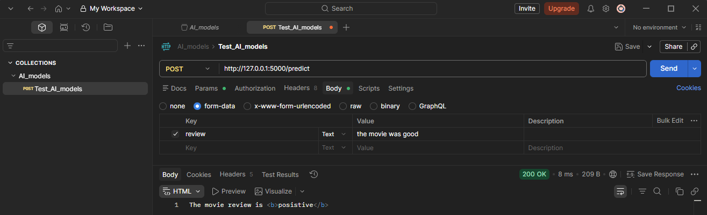
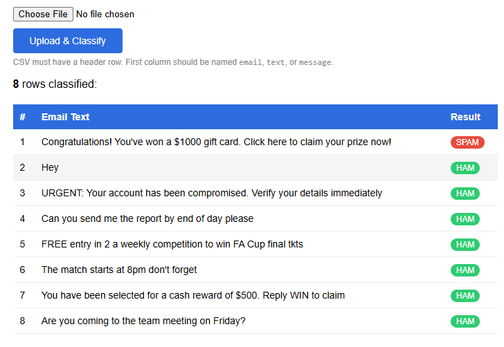
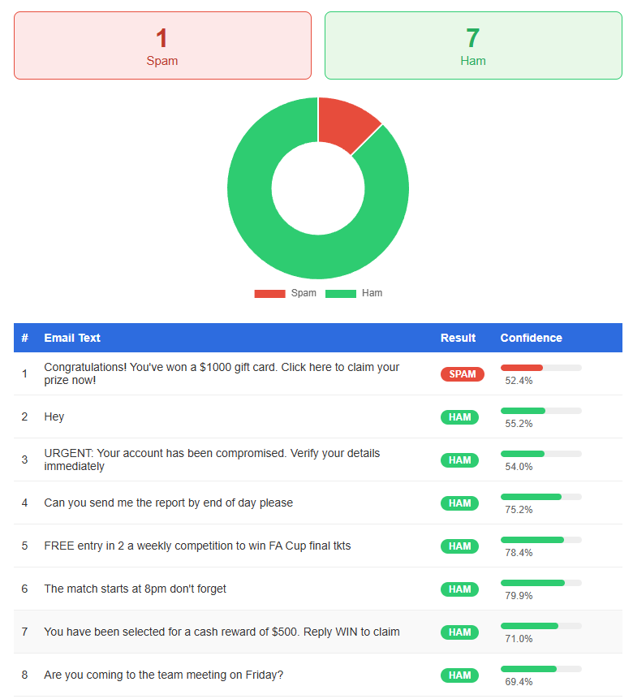

Section 8 Day 7 Deploying an AI Model as a Web Service

## Objective:
Day 6 introduces Natural Language Processing (NLP) and focuses on text classification through sentiment analysis. We will build a sentiment analysis model that classifies text as positive or negative using a pre-trained model from Hugging Face.

## Learning Outcomes:

By the end of the day, we will:

    Understand the basics of NLP and its importance in AI.
    Learn text preprocessing techniques such as tokenization, stemming, and vectorization.
    Build a sentiment analysis model using a pre-trained NLP model.
    Evaluate the model using metrics such as accuracy and F1-score.
    Understand the concept of transfer learning for NLP tasks.


## Content
48. [Deploying an AI Model as a Web Service](#48-deploying-an-ai-model-as-a-web-service)
49. [Introduction to Flask for Web Development](#49-introduction-to-flask-for-web-development)
50. [Creating a Web Interface for Your Model](#50-creating-a-web-interface-for-your-model)
51. [Deploying the Flask App to Heroku](#51-deploying-the-flask-app-to-heroku)
52. [Testing the Web Service](#52-testing-the-web-service)

[Assignment 7: Day 7: Coding Exercise](#assignment-7-day-7-coding-exercise)


<br>
<br>

## 48. Deploying an AI Model as a Web Service

[⬆ Back to content](#content)

Objective:

On Day 7, we will deploy a machine learning model as a web service using Flask. The goal is to build an end-to-end application where users can input data, and the deployed AI model will return predictions. This day will focus on integrating AI models into web applications and deploying them on a cloud platform like Heroku.

Learning Outcomes:
By the end of the day, we will:

    Understand the basics of web development using Flask.
    Learn how to integrate a machine learning model into a web application.
    Deploy a machine learning model as a RESTful API.
    Deploy the application on a cloud platform like Heroku for public access.


[⬆ Back to content](#content)

## 49. Introduction to Flask for Web Development

[⬆ Back to content](#content)

- What is Flask?
Flask is a lightweight web framework for Python. It is used to create web applications quickly, and it's especially useful for deploying machine learning models as a web service.

- Installing Flask
terminal --> pip install flask


- Basic Flask Application

Create a server.py file

```python
from flask import Flask

app = Flask(__name__)

@app.route('/')
def home():
    return "Hello World!"

if __name__ == "__main__":
    app.run(debug=True)
```

Run the file
    terminal --> python server.py

Result: 
 * Serving Flask app 'server'       
 * Debug mode: on       
WARNING: This is a development server. Do not use it in a production deployment. Use a production WSGI  server instead.     
 * Running on http://127.0.0.1:5000     
Press CTRL+C to quit        
 * Restarting with stat     
 * Debugger is active!      
 * Debugger PIN: 105-375-004        


Go to http://127.0.0.1:5000 and check that the text 'Hello World!' is present


[⬆ Back to content](#content)

## 50. Creating a Web Interface for Your Model

[⬆ Back to content](#content)

We will create or use logistic regression to create a prediction model from IMDb database.
Then we can load our trained model using pickle or Joblib and create a function to make predictions.

Step 1: Build a Prediction Function
Step 2: Create a Flask Web Form for Input
Step 3: Create the Prediction Route

### Step 1: Build a Prediction Function 

```python
import pandas as pd
from sklearn.model_selection import train_test_split
from sklearn.feature_extraction.text import TfidfVectorizer
from sklearn.linear_model import LogisticRegression
from sklearn.metrics import accuracy_score
import joblib
import numpy as np
from keras.datasets import imdb
from keras.preprocessing import sequence

# Load IMDB Dataset
## Number of words to keep
num_words = 5000

## How much data I want to load from the IMDb database
(X_train, y_train), (X_test, y_test) = imdb.load_data(num_words=num_words)

## Convert the integer sequences back to word using Keras word index
word_index = imdb.get_word_index()

## define the reverse mapping for converting word index back to towards
reverse_word_index = {v:k for k, v in word_index.items()}

## Convert sequences to readable text for use with Tfidf
def decode_review(text_sequence):
    return " ".join([reverse_word_index.get(i - 3, "?") for i in text_sequence])

## decode the text sequences
X_train_text = [decode_review(seq) for seq in X_train]
X_test_text = [decode_review(seq) for seq in X_test]

# Data preprocessing
## Convert the text data into numerical features using TF-IDF where we are using Vectorizer
vectorizer = TfidfVectorizer(stop_words='english', max_features=num_words)
X_train_tfidf = vectorizer.fit_transform(X_train_text)
X_test_tfidf = vectorizer.transform(X_test_text)

## Training the logistic regression model
model = LogisticRegression(max_iter=200)
model.fit(X_train_tfidf, y_train)

## Evaluate the model
y_pred = model.predict(X_test_tfidf)
accuracy = accuracy_score(y_test, y_pred)
print(f"Model Accuracy: {accuracy:.4f}")

## Save the model and vectorize using Joblib
joblib.dump(model, 'imdb_sentiment_model.pkl')  # name the model
joblib.dump(vectorizer, 'imdb_vectorizer.pkl')  # vectorize the model
```
Play: shift + enter<br>
Result:<br>

Model Accuracy: 0.8778      

['imdb_vectorizer.pkl']     

We can find our model in the working directory


### Step 2: Create a Flask Web Form for Input

Create templates/index.html file as follow for user interface

```html
<html>
<body>
    <h1>Movie Review</h1>
    <form action="/predict" method="post">
        <label for="review">Enter Review Text</label><br>
        <textarea name="review" rows="10", cols="50"></textarea><br><br>
        <input type="submit" value="submit">
    </form>
</body>
</html>
```
Create template directory and save the file in it.
We can test the template.


Edit the server.py and render the created template:

```python
from flask import Flask, render_template, request
import joblib

app = Flask(__name__)

model = joblib.load('imdb_sentiment_model.pkl')
vectorizer = joblib.load('imdb_vectorizer.pkl')

@app.route('/')
def home():
    return render_template('index.html')

@app.route('/predict', methods=['POST'])

def predict():
    review = request.form['review']

    if not review:
        return "No Review Avalable"

    review_tfidf = vectorizer.transform([review])
    prediction = model.predict(review_tfidf)[0]

    sentiment = 'posistive' if prediction == 1 else 'negative'

    return f"The movie review is <b>{sentiment}</b>"

if __name__ == "__main__":
    app.run(debug=True)
```

Run the server in VSCode or other IDE
    terminal --> python server.py

Go to http://127.0.0.1:5000 and test two cases. First enter 'movie was super' and click submit. The result should be 'The movie review is posistive'. The test with 'movie was horrible'. The result should be 'The movie review is negative''.


[⬆ Back to content](#content)

## 51. Deploying the Flask App to Heroku

[⬆ Back to content](#content)

### Step 1: Setting Up Heroku

#### Register to https://www.heroku.com/

#### install Heroku CLI with npm - https://devcenter.heroku.com/articles/heroku-cli#install-with-npm
    terminal --> npm install -g heroku

Check the version
    terminal --> heroku --version

    # result: heroku/11.4.0 win32-x64 node-v24.14.1

Login to Heroku
    terminal --> heroku login

### Step 2: Prepare the Application for Deployment

Create a Procfile that configure the application start

```Procfile
web: gunicorn app:app
```

Create a requirements.txt file

```text
Flask==3.1.3
joblib==1.5.3
scikit-learn
gunicorn
```

Set the folder WebApp nad rename server.py to app.py

Create a separate repository on git with the structure:

HerokuWebApp
    templates
        index.html
    app.py
    imdb_sentiment_model.pkl
    imdb_vectorizer.pkl
    Procfile
    requirements.txt

We can push the rpository to GitHub or leave it locally. I this example we will leave it locally

Set local repostiory
    terminal --> git init

Commit the files
    terminal --> git add .
    terminal --> git commit -m "initial commit"


Step 3: Deploying to Heroku

Create the heroku app
    terminal --> heroku create

Push the application 
    terminal --> git push heroku master

Wait a few minutes and open the app
    terminal --> heroku open

We can now access our application and test it.

We can list our Heroku apps:
    terminal --> heroku apps

Delete the deployed application after testing it to avoid bill accumulations.
    terminal --> heroku apps:destroy --confirm YOUR_APP_NAME


[⬆ Back to content](#content)

## 52. Testing the Web Service

[⬆ Back to content](#content)

- Testing the API
- Handling Edge Cases

Task: Deploy the machine learning model you built as a web service using Flask and Heroku.
Steps:

    Build a Flask application that allows users to input text (e.g., email, review) and get predictions.
    Integrate your machine learning model into the Flask application to provide predictions based on the input.
    Deploy the application on Heroku to make it publicly accessible.
    Test the application by making predictions and handling different user inputs.

Exercises

    Deploy a different machine learning model (such as the sentiment analysis model from Day 6) and build a web service around it.
    Extend the Flask app to handle multiple predictions at once by allowing the user to upload a file (e.g., a CSV of emails).
    Add more features to the web interface, such as model confidence scores or visualizations of the predictions.

We will continue testing our application locally to avoid heroku bills accumulation.

Test the API and also handle edge cases:

We can test the web service by entering text in the form. Or we can send a request using postman or SQL to simulate a client interacting with the API.

Start the application locally
    terminal --> python app.py

We will use Postman to test the application as API


<br>
<br>

We can use the app with curl:

Case 1:
    CMD --> curl -X POST http://127.0.0.1:5000/predict -F "review=the movie was good"

    # result: The movie review is <b>posistive</b>

Case 2:
    CMD --> curl -X POST http://127.0.0.1:5000/predict -F "review=the movie was bad"

    # result: The movie review is <b>negative</b>

[⬆ Back to content](#content)

## Assignment 7: Day 7: Coding Exercise

[⬆ Back to content](#content)

Assigment:

Try to complete these assignments using Jupyter Notebook or your favorite editor in Python

Questions for this assignment:

Task 1: Deploy a different machine learning model and build a web service around it.
Task 2: Extend the Flask app to handle multiple predictions at once by allowing the user to upload a file (e.g., a CSV of emails).
Task 3: Add more features to the web interface, such as model confidence scores or visualizations of the predictions.

Task 1: Deploy a different machine learning model and build a web service around it.
```python
"""
Task 1 - Train a Spam Email Classifier (Naive Bayes)
Run this once to generate the saved model and vectorizer:
    terminal --> python train_model.py
"""

from sklearn.datasets import fetch_20newsgroups
from sklearn.feature_extraction.text import TfidfVectorizer
from sklearn.naive_bayes import MultinomialNB
from sklearn.metrics import accuracy_score, classification_report
import joblib

# ── Load a binary subset of 20 Newsgroups as a stand-in spam/ham dataset ──
# 'talk.politics.misc' acts as "spam", 'rec.sport.baseball' acts as "ham"
categories = ['talk.politics.misc', 'rec.sport.baseball']
label_names = {0: 'ham (not spam)', 1: 'spam'}

train_data = fetch_20newsgroups(subset='train', categories=categories, remove=('headers', 'footers', 'quotes'))
test_data  = fetch_20newsgroups(subset='test',  categories=categories, remove=('headers', 'footers', 'quotes'))

X_train, y_train = train_data.data, train_data.target
X_test,  y_test  = test_data.data,  test_data.target

# ── Vectorize with TF-IDF ──
vectorizer = TfidfVectorizer(stop_words='english', max_features=5000)
X_train_tfidf = vectorizer.fit_transform(X_train)
X_test_tfidf  = vectorizer.transform(X_test)

# ── Train Naive Bayes ──
model = MultinomialNB()
model.fit(X_train_tfidf, y_train)

# ── Evaluate ──
y_pred = model.predict(X_test_tfidf)
print(f"Accuracy: {accuracy_score(y_test, y_pred):.4f}\n")
print(classification_report(y_test, y_pred, target_names=['ham', 'spam']))

# ── Save model and vectorizer ──
joblib.dump(model,      'spam_classifier_model.pkl')
joblib.dump(vectorizer, 'spam_vectorizer.pkl')
print("Model saved: spam_classifier_model.pkl")
print("Vectorizer saved: spam_vectorizer.pkl")
```
Play: shift + enter<br>
Result:<br>

Accuracy: 0.9349        

              precision    recall  f1-score   support       

         ham       0.92      0.97      0.94       397       
        spam       0.96      0.89      0.92       310       

    accuracy                           0.93       707       
   macro avg       0.94      0.93      0.93       707       
weighted avg       0.94      0.93      0.93       707       

Model saved: spam_classifier_model.pkl      
Vectorizer saved: spam_vectorizer.pkl    

THE MODEL IS NOT VERY RELIABLE BUT IS WORKING FOR THE EXAMPLE.

Copy the model and vectorizer in the project folder. The project folder should look like this:

SpamClassifierApp
    termplates
        index.html
    app.py
    requirements.txt
    spam_classifier_model.pkl
    spam_vectorizer.pkl

app.py:

```python
"""
Task 1 - Spam Classifier Web Service
Run with:
    terminal --> python app.py
Then open http://127.0.0.1:5000
"""

from flask import Flask, render_template, request
import joblib

app = Flask(__name__)

# Load the saved model and vectorizer (run train_model.py first)
model      = joblib.load('spam_classifier_model.pkl')
vectorizer = joblib.load('spam_vectorizer.pkl')


@app.route('/')
def home():
    return render_template('index.html')


@app.route('/predict', methods=['POST'])
def predict():
    email_text = request.form.get('email_text', '').strip()

    if not email_text:
        return render_template('index.html', result="Please enter some text.", label="")

    # Vectorize and predict
    text_tfidf  = vectorizer.transform([email_text])
    prediction  = model.predict(text_tfidf)[0]

    label = 'SPAM' if prediction == 1 else 'HAM (Not Spam)'

    return render_template('index.html', result=label, input_text=email_text)


if __name__ == '__main__':
    app.run(debug=True)
```

Start the application
    terminal --> python app.py

Open the app on http://127.0.0.1:5000/ and test it with text 'Win a free iPhone now click here' and 'Congratulations! You've won a $1000 gift card. Click here to claim your prize now!'.

We can test the app with CMD and curl:
    CMD --> curl -X POST http://127.0.0.1:5000/predict -F "email_text=Win a free iPhone now click here"

    # result: Not spam

    CMD --> curl -X POST http://127.0.0.1:5000/predict -F "email_text=Congratulations! You've won a $1000 gift card. Click here to claim your prize now!"

    # result: Spam


Task 2: Extend the Flask app to handle multiple predictions at once by allowing the user to upload a file (e.g., a CSV of emails).

Project structure:

SpamClassifierApp
    termplates
        index.html
    app.py
    requirements.txt
    spam_classifier_model.pkl
    spam_vectorizer.pkl

app.py
```python
"""
Task 2 - Spam Classifier Web Service with CSV Bulk Upload
Run with:
    terminal --> python app.py
Then open http://127.0.0.1:5000
"""

from flask import Flask, render_template, request
import joblib
import csv
import io

app = Flask(__name__)

# Load the saved model and vectorizer (run train_model.py first)
model      = joblib.load('spam_classifier_model.pkl')
vectorizer = joblib.load('spam_vectorizer.pkl')


@app.route('/')
def home():
    return render_template('index.html')


@app.route('/predict', methods=['POST'])
def predict():
    email_text = request.form.get('email_text', '').strip()

    if not email_text:
        return render_template('index.html', result="Please enter some text.", label="")

    text_tfidf = vectorizer.transform([email_text])
    prediction = model.predict(text_tfidf)[0]
    label      = 'SPAM' if prediction == 1 else 'HAM (Not Spam)'

    return render_template('index.html', result=label, input_text=email_text)


@app.route('/predict_csv', methods=['POST'])
def predict_csv():
    file = request.files.get('csv_file')

    if not file or file.filename == '':
        return render_template('index.html', csv_error="No file selected.")

    if not file.filename.endswith('.csv'):
        return render_template('index.html', csv_error="Please upload a .csv file.")

    # Read and decode the uploaded CSV
    stream  = io.StringIO(file.stream.read().decode('utf-8'))
    reader  = csv.reader(stream)
    rows    = list(reader)

    if len(rows) < 2:
        return render_template('index.html', csv_error="CSV is empty or has no data rows.")

    header   = rows[0]
    data_rows = rows[1:]

    # Expect a single column named 'email' (case-insensitive), or just use column 0
    col_index = 0
    if header and header[0].strip().lower() in ('email', 'text', 'message'):
        col_index = 0

    results = []
    for row in data_rows:
        if not row or len(row) <= col_index:
            continue
        text       = row[col_index].strip()
        tfidf      = vectorizer.transform([text])
        prediction = model.predict(tfidf)[0]
        label      = 'SPAM' if prediction == 1 else 'HAM'
        results.append({'text': text, 'label': label})

    return render_template('index.html', csv_results=results)


if __name__ == '__main__':
    app.run(debug=True)
```

Start the application
    terminal --> python app.py

Open the app on http://127.0.0.1:5000/ and test it with texts from the provided sample_emails.csv file


<br>
<br>

We can test the app with CMD and curl:
    CMD --> curl -X POST http://127.0.0.1:5000/predict -F "email_text=Congratulations you won a free iPhone click here to claim"

    # result: Spam


Task 3: Add more features to the web interface, such as model confidence scores or visualizations of the predictions.

Project structure is the same:

SpamClassifierApp
    termplates
        index.html
    app.py
    requirements.txt
    spam_classifier_model.pkl
    spam_vectorizer.pkl

We modify the HTML file and app.py files. Now when we submit file with emails the result will be visualized as pie diagrams.

```python
"""
Task 3 - Spam Classifier with Confidence Scores and Visualizations
Run with:
    terminal --> python app.py
Then open http://127.0.0.1:5000
"""

from flask import Flask, render_template, request
import joblib
import csv
import io

app = Flask(__name__)

model      = joblib.load('spam_classifier_model.pkl')
vectorizer = joblib.load('spam_vectorizer.pkl')


@app.route('/')
def home():
    return render_template('index.html')


@app.route('/predict', methods=['POST'])
def predict():
    email_text = request.form.get('email_text', '').strip()

    if not email_text:
        return render_template('index.html', error="Please enter some text.")

    tfidf        = vectorizer.transform([email_text])
    prediction   = model.predict(tfidf)[0]
    probabilities = model.predict_proba(tfidf)[0]  # [prob_ham, prob_spam]

    label        = 'SPAM' if prediction == 1 else 'HAM'
    spam_pct     = round(probabilities[1] * 100, 1)
    ham_pct      = round(probabilities[0] * 100, 1)

    return render_template(
        'index.html',
        input_text  = email_text,
        label       = label,
        spam_pct    = spam_pct,
        ham_pct     = ham_pct,
    )


@app.route('/predict_csv', methods=['POST'])
def predict_csv():
    file = request.files.get('csv_file')

    if not file or file.filename == '':
        return render_template('index.html', csv_error="No file selected.")
    if not file.filename.endswith('.csv'):
        return render_template('index.html', csv_error="Please upload a .csv file.")

    stream    = io.StringIO(file.stream.read().decode('utf-8'))
    reader    = csv.reader(stream)
    rows      = list(reader)

    if len(rows) < 2:
        return render_template('index.html', csv_error="CSV is empty or has no data rows.")

    header    = rows[0]
    data_rows = rows[1:]
    col_index = 0
    if header and header[0].strip().lower() in ('email', 'text', 'message'):
        col_index = 0

    results     = []
    spam_count  = 0
    ham_count   = 0

    for row in data_rows:
        if not row or len(row) <= col_index:
            continue
        text          = row[col_index].strip()
        tfidf         = vectorizer.transform([text])
        prediction    = model.predict(tfidf)[0]
        probabilities = model.predict_proba(tfidf)[0]
        label         = 'SPAM' if prediction == 1 else 'HAM'
        spam_pct      = round(probabilities[1] * 100, 1)
        ham_pct       = round(probabilities[0] * 100, 1)

        if label == 'SPAM':
            spam_count += 1
        else:
            ham_count += 1

        results.append({
            'text':     text,
            'label':    label,
            'spam_pct': spam_pct,
            'ham_pct':  ham_pct,
        })

    return render_template(
        'index.html',
        csv_results = results,
        spam_count  = spam_count,
        ham_count   = ham_count,
    )


if __name__ == '__main__':
    app.run(debug=True)
```

Start the application
    terminal --> python app.py

Open the app on http://127.0.0.1:5000/ and test it with texts from the provided sample_emails.csv file


<br>
<br>


We can test the app with CMD and curl:
    CMD --> curl -X POST http://127.0.0.1:5000/predict -F "email_text=Congratulations you won a free iPhone click here to claim"

    # result: Spam

[⬆ Back to content](#content)


curl --location 'http://127.0.0.1:5000/predict' --form 'review="the movie was good"'


